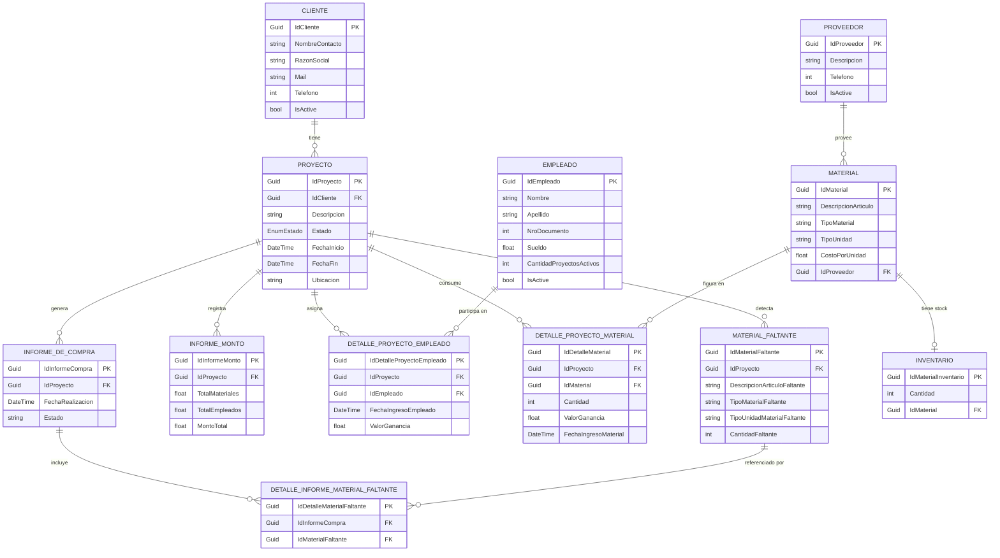
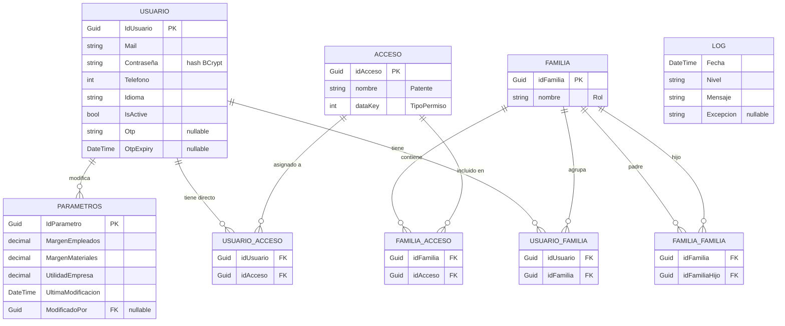
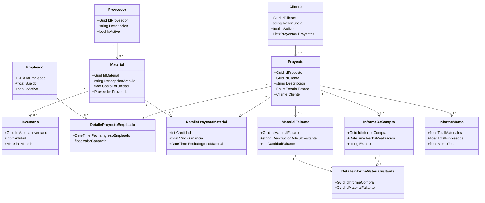
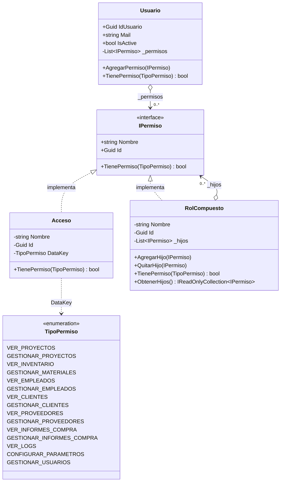

# Diagramas de Modelo — Entidad-Relación y Clases (actualizados)

Este archivo actualiza los diagramas de **Entidad-Relación (ER)** y de **Clases** del documento original, incorporando las entidades que faltaban respecto del código real del sistema:

- **Seguridad / RBAC:** `Usuario`, `Familia` (Rol), `Acceso` (Patente) y sus tablas puente.
- **Configuración:** `Parametros` (márgenes y utilidad de la empresa).
- **Auditoría:** `Log` (bitácora de eventos).
- **Negocio:** `MaterialFaltante`, `InformeDeCompra`, `DetalleInformeMaterialFaltante` e `InformeMonto`, que no estaban (o estaban incompletos) en los diagramas originales.

> **Imágenes ya renderizadas:** los dos diagramas ER están exportados como SVG en `Docs/diagramas/`:
> - `ER_Negocio.svg`
> - `ER_Seguridad.svg`
>
> Se pueden insertar directamente en el Word (Insertar → Imágenes). El bloque Mermaid de cada diagrama se incluye también como fuente editable por si querés regenerarlos o modificarlos.

---

## 1. Arquitectura de persistencia (3 bases de datos)

El sistema **no usa una única base**, sino tres bases SQL Server separadas. Esto es relevante para los diagramas: no hay claves foráneas *físicas* entre bases; las relaciones que cruzan bases (ej. `Parametros.ModificadoPor → Usuario`) son **referencias lógicas**.

| Base de datos | Contenido | Acceso |
|---|---|---|
| **GestorCMB** | Datos del negocio (clientes, proyectos, materiales, empleados, informes) | Entity Framework 6 (EDMX, Database-First) |
| **GestorCMB_Users** | Seguridad/RBAC (usuarios, familias, accesos) y parámetros | ADO.NET directo (repositorios manuales) |
| **GestorCMB_Logs** | Bitácora de eventos (`Log`) | ADO.NET directo |

---

## 2. Diagrama Entidad-Relación — Negocio (base `GestorCMB`)

Imagen renderizada: **`Docs/diagramas/ER_Negocio.svg`**



**Notas de este diagrama:**

- **`MATERIAL_FALTANTE` no tiene FK hacia `MATERIAL`.** Guarda la descripción, tipo y unidad como **texto** (`DescripcionArticuloFaltante`, etc.). Al confirmar una compra, el sistema busca el material en inventario **por coincidencia de texto** (descripción + tipo + unidad, sin distinguir mayúsculas ni espacios), no por clave foránea. Es una decisión de diseño: un faltante puede describir algo que todavía no existe como `Material` cargado.
- **`INFORME_DE_COMPRA.Estado`** es un `string` con tres valores: `pendiente` / `finalizado` / `cancelado` (soft-delete por estado).
- **`INVENTARIO`** mantiene el stock por material (relación 1 a 0..1 con `MATERIAL`).
- Las entidades con baja lógica (`IsActive`) **no se borran físicamente**: `Cliente`, `Empleado`, `Proveedor`.

---

## 3. Diagrama Entidad-Relación — Seguridad y Bitácora (bases `GestorCMB_Users` + `GestorCMB_Logs`)

Imagen renderizada: **`Docs/diagramas/ER_Seguridad.svg`**

Este es el modelo **Familia / Patente** (Rol / Acceso): un usuario obtiene permisos por dos vías combinables — **accesos directos** y **familias (roles)** —, y las familias pueden contener otras familias (jerarquía → patrón *Composite*).



**Notas de este diagrama:**

- **`FAMILIA` = Rol, `ACCESO` = Patente.** Un `Acceso` mapea 1 a 1 con un valor del enum `TipoPermiso` (campo `dataKey`); hay 15 patentes posibles.
- **`FAMILIA_FAMILIA`** es la relación recursiva que habilita el patrón *Composite*: una familia puede contener familias hijas. Permite roles compuestos (ej. "Gerente" que incluye los permisos de "Jefe de Obra" más otros).
- **Doble vía de permisos:** `USUARIO_ACCESO` (permisos directos del usuario) + `USUARIO_FAMILIA` (permisos heredados de sus roles). El permiso efectivo es la **unión** de ambas.
- **`PARAMETROS`** vive en `GestorCMB_Users`. Su campo `ModificadoPor` referencia *lógicamente* a `Usuario` (no es FK física porque, aunque comparten base aquí, el acceso es por ADO.NET sin constraints declaradas).
- **`LOG`** vive en una base aparte (`GestorCMB_Logs`) y **no tiene FK** hacia ninguna entidad: es una bitácora plana de eventos (`Fecha`, `Nivel`, `Mensaje`, `Excepcion`).

---

## 4. Diagrama de Clases — Modelo de dominio (base `GestorCMB`)

Imagen renderizada: **`Docs/diagramas/Clases_Dominio.svg`**

Las entidades del dominio son objetos de datos (propiedades + propiedades de navegación de EF). Los atributos completos están en el ER de la sección 2; acá se resaltan las **relaciones de navegación** entre clases.



---

## 5. Diagrama de Clases — Patrón Composite del RBAC (seguridad)

Imagen renderizada: **`Docs/diagramas/Clases_Composite_RBAC.svg`**

Este es el aporte de diseño más relevante para la defensa: el control de permisos está resuelto con el **patrón Composite**. Tanto un permiso individual (`Acceso`, *hoja*) como un grupo de permisos (`RolCompuesto`, *compuesto*) implementan la misma interfaz `IPermiso`, de modo que el `Usuario` consulta permisos de forma uniforme sin saber si está preguntándole a una hoja o a un compuesto.



**Cómo se lee el patrón:**

- **`IPermiso`** = *Component*. Define `TienePermiso(TipoPermiso)`.
- **`Acceso`** = *Leaf* (hoja). Devuelve `true` solo si su `DataKey` coincide con el permiso consultado.
- **`RolCompuesto`** = *Composite*. Mantiene una lista de hijos `IPermiso` (que pueden ser `Acceso` u otros `RolCompuesto`) y delega la consulta recursivamente: devuelve `true` si **algún** hijo tiene el permiso.
- **`Usuario`** consulta `TienePermiso(...)` sobre su colección de `IPermiso` sin distinguir hojas de compuestos → polimorfismo uniforme, núcleo del patrón.
- La estructura de árbol se persiste en las tablas `Familia`, `Acceso`, `Familia_Familia`, `Familia_Acceso`, `Usuario_Familia` y `Usuario_Acceso` (ver sección 3).

---

## 6. Observaciones de cobertura

| Entidad / concepto | ¿Estaba en el doc original? | Acción |
|---|---|---|
| `Usuario` | Incompleta / ausente | Agregada (con `Otp`/`OtpExpiry` para recuperación) |
| `Familia` (Rol) | Ausente | Agregada |
| `Acceso` (Patente) | Ausente | Agregada |
| Tablas puente RBAC | Ausentes | Agregadas (`Usuario_Familia`, `Usuario_Acceso`, `Familia_Acceso`, `Familia_Familia`) |
| `Parametros` | Ausente | Agregada |
| `Log` (bitácora) | Ausente | Agregada |
| `MaterialFaltante` | Ausente / incompleta | Agregada |
| `InformeDeCompra` + `Estado` | Incompleta | Completada (soft-delete por estado) |
| `DetalleInformeMaterialFaltante` | Ausente | Agregada |
| `InformeMonto` | Ausente / incompleta | Agregada |
| Patrón Composite (RBAC) | No diagramado | Diagrama de clases dedicado (sección 5) |

### Ubicación sugerida en el documento principal

- Las **secciones 2 y 3** (ER) reemplazan al diagrama Entidad-Relación original.
- La **sección 4** (clases de dominio) reemplaza/actualiza el diagrama de clases del modelo de negocio.
- La **sección 5** (Composite) se suma como diagrama de clases del subsistema de seguridad; conviene ubicarla junto a la explicación de patrones de diseño.

### Cómo regenerar las imágenes

Los bloques ```mermaid``` son la fuente editable. Para volver a generar los SVG/PNG: pegá el bloque en [mermaid.live](https://mermaid.live) y exportá, o pedímelo y los regenero con la herramienta de Mermaid. Los cuatro diagramas ya están renderizados en `Docs/diagramas/`:

| Sección | Archivo |
|---|---|
| 2. ER de Negocio | `ER_Negocio.svg` |
| 3. ER de Seguridad y Bitácora | `ER_Seguridad.svg` |
| 4. Clases de dominio | `Clases_Dominio.svg` |
| 5. Composite del RBAC | `Clases_Composite_RBAC.svg` |

> Nota: `ER_Negocio.svg` tiene un ajuste manual de posición de la caja `EMPLEADO` (se subió ~60px para despejar el cruce con `MATERIAL_FALTANTE`). Si regenerás ese diagrama desde la fuente Mermaid, el ajuste se pierde.
