# 5. Diagramas de secuencia — Gestor CMB

> Fuente única consolidada para la **Sección 5** del documento. Cada subsección incluye:
> 1. una **nota de diseño** con el patrón / regla de negocio que destaca el diagrama,
> 2. el **SVG renderizado** (lo que se inserta en el Word), y
> 3. el **código fuente Mermaid** (para regenerar o editar el diagrama).
>
> Todos los diagramas fueron verificados contra el código real (UI → BL → DAL → SQL).

## Convenciones de los diagramas

- Participantes etiquetados por capa: `(UI)`, `(BL)`, `(DAL)`, más la base de datos.
- Tres bases SQL Server: **GestorCMB** (negocio, EF6), **GestorCMB_Users** (RBAC + parámetros, ADO.NET) y **GestorCMB_Logs** (bitácora).
- Patrones presentes: **Composite** (RBAC y logging), **Strategy** (logging), **Repository + Unit of Work + Factory** (EF6), **Singleton** (`LanguageService`, `ParametrosContext`).

## Patrones por diagrama (resumen)

| Subsección | Diagrama | Patrón / regla destacada |
|---|---|---|
| 5.1.1 | Login | BCrypt (wf 12) + retrocompatibilidad SHA-256, hidratación de permisos (Composite) |
| 5.1.2 | Recuperación por OTP | OTP de 6 dígitos con expiración 15 min, rehash BCrypt |
| 5.2.1 | Crear usuario | Validación + duplicado por mail + hash BCrypt + rol inicial |
| 5.2.2 | Modificar usuario | Reinicio de la app si el usuario cambia su propio idioma |
| 5.2.3 | Activar/Desactivar usuario | Baja lógica `IsActive` + reversión del toggle ante error |
| 5.2.4 | Asignar rol a usuario | Composite: `Usuario_Familia` (hereda accesos del rol) |
| 5.2.5 | Gestionar permisos de un rol | Composite `Familia_Acceso`, rol Administrador protegido |
| 5.2.6 | Crear rol | Nueva `Familia` vacía del Composite |
| 5.2.7 | Crear permiso/acceso | Hoja del Composite + `dataKey` (TipoPermiso) |
| 5.2.8 | Cambiar idioma | Singleton `LanguageService` + `Resources.resx` (i18n) |
| 5.3 | Gestión de clientes | ABM con Repository + Unit of Work (EF6) |
| 5.4 | Gestión de empleados | Ídem + doble permiso (VER / GESTIONAR) |
| 5.5.1 | Materiales faltantes | Upsert acumulativo + origen del flujo de compra |
| 5.5.2 | Confirmar informe de compra | Matcheo por texto, snapshot, cierre de estados |
| 5.5.3 | Administrar informes de compra | Baja lógica por estado (cancelado/finalizado) |
| 5.6.1 | Inventario — Listar | Badge "pendiente en informe" por NormKey |
| 5.6.2 | Inventario — Gestionar materiales | Alta crea Material + Inventario(0); borrado físico por FK |
| 5.6.3 | Inventario — Gestionar stock | `CambiarCantidad ±1`, clamp a 0, **sin bitácora** |
| 5.7 | Gestión de proveedores | ABM EF6, baja lógica por FK con Material |
| 5.8.1 | Proyectos — Listar | Orden/filtro + conteo de faltantes (N+1) |
| 5.8.2 | Proyectos — Cargar | Alta con estado inicial EnProceso |
| 5.8.3 | Proyectos — Ver detalle | Materiales + empleados + faltantes + montos |
| 5.8.4 | Proyectos — Asignar materiales | `min(stock, solicitada)` + registro de faltante |
| 5.8.5 | Proyectos — Asignar empleados + montos | Máx. 3 proyectos activos + cálculo con parámetros |
| 5.9 | Configurar parámetros | ADO.NET + autobootstrap + cache Singleton |
| 5.10 | Grabar bitácora | Strategy + Composite (aislamiento de fallas por destino) |

---

# 5.1 Autenticación de usuarios

## 5.1.1 Login y autenticación

**Diseño:** verifica la contraseña con BCrypt (work factor 12) y mantiene **retrocompatibilidad** con hashes SHA-256 heredados. Tras autenticar, hidrata el usuario con sus `Acceso` (hojas del Composite RBAC) y carga parámetros e idioma.

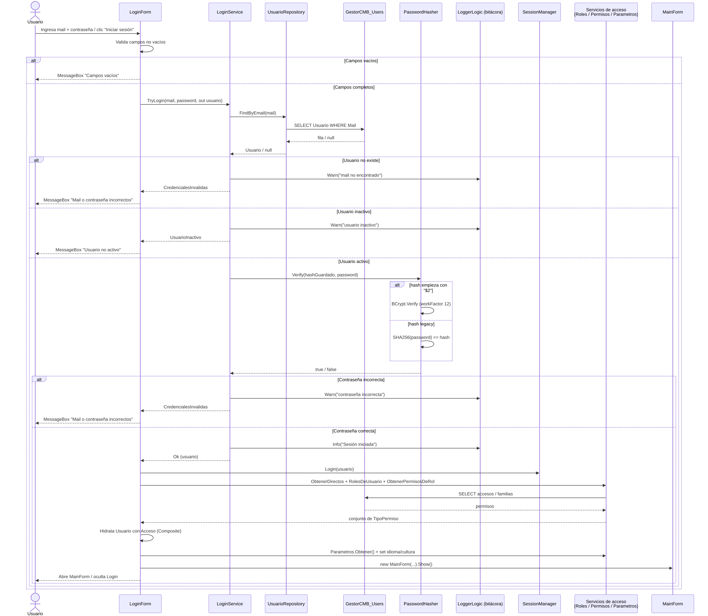

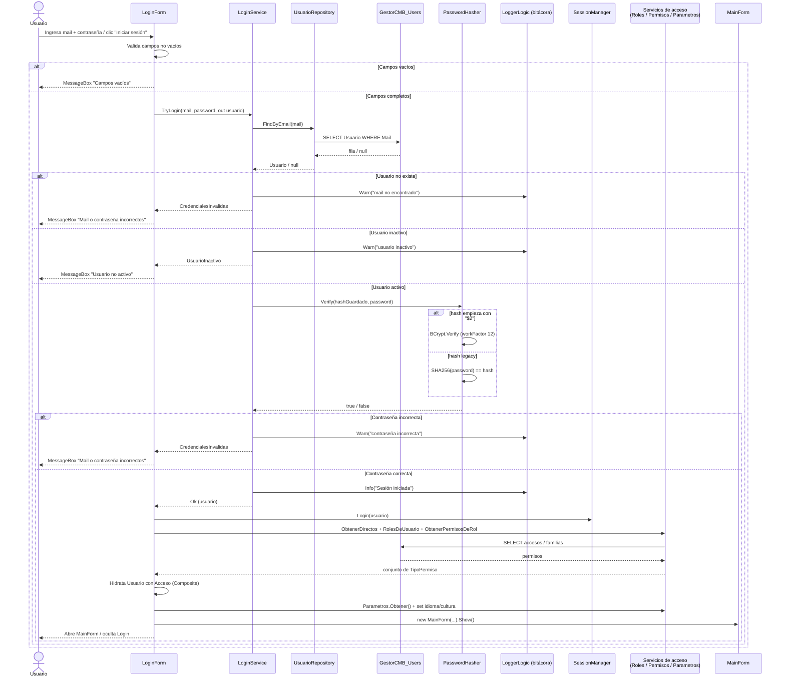
```mermaid
sequenceDiagram
    actor U as Usuario
    participant LF as LoginForm
    participant LS as LoginService
    participant UR as UsuarioRepository
    participant DB as GestorCMB_Users
    participant PH as PasswordHasher
    participant Log as LoggerLogic (bitácora)
    participant SM as SessionManager
    participant AS as Servicios de acceso<br/>(Roles / Permisos / Parametros)
    participant MF as MainForm

    U->>LF: Ingresa mail + contraseña / clic "Iniciar sesión"
    LF->>LF: Valida campos no vacíos
    alt Campos vacíos
        LF-->>U: MessageBox "Campos vacíos"
    else Campos completos
        LF->>LS: TryLogin(mail, password, out usuario)
        LS->>UR: FindByEmail(mail)
        UR->>DB: SELECT Usuario WHERE Mail
        DB-->>UR: fila / null
        UR-->>LS: Usuario / null
        alt Usuario no existe
            LS->>Log: Warn("mail no encontrado")
            LS-->>LF: CredencialesInvalidas
            LF-->>U: MessageBox "Mail o contraseña incorrectos"
        else Usuario inactivo
            LS->>Log: Warn("usuario inactivo")
            LS-->>LF: UsuarioInactivo
            LF-->>U: MessageBox "Usuario no activo"
        else Usuario activo
            LS->>PH: Verify(hashGuardado, password)
            alt hash empieza con "$2"
                PH->>PH: BCrypt.Verify (workFactor 12)
            else hash legacy
                PH->>PH: SHA256(password) == hash
            end
            PH-->>LS: true / false
            alt Contraseña incorrecta
                LS->>Log: Warn("contraseña incorrecta")
                LS-->>LF: CredencialesInvalidas
                LF-->>U: MessageBox "Mail o contraseña incorrectos"
            else Contraseña correcta
                LS->>Log: Info("Sesión iniciada")
                LS-->>LF: Ok (usuario)
                LF->>SM: Login(usuario)
                LF->>AS: ObtenerDirectos + RolesDeUsuario + ObtenerPermisosDeRol
                AS->>DB: SELECT accesos / familias
                DB-->>AS: permisos
                AS-->>LF: conjunto de TipoPermiso
                LF->>LF: Hidrata Usuario con Acceso (Composite)
                LF->>AS: Parametros.Obtener() + set idioma/cultura
                LF->>MF: new MainForm(...).Show()
                LF-->>U: Abre MainForm / oculta Login
            end
        end
    end
```

## 5.1.2 Recuperación por OTP

**Diseño:** flujo en dos pasos. Genera un OTP de 6 dígitos con expiración a 15 minutos, lo envía por SMTP, y al validarlo rehashea la nueva contraseña con BCrypt y limpia el OTP.

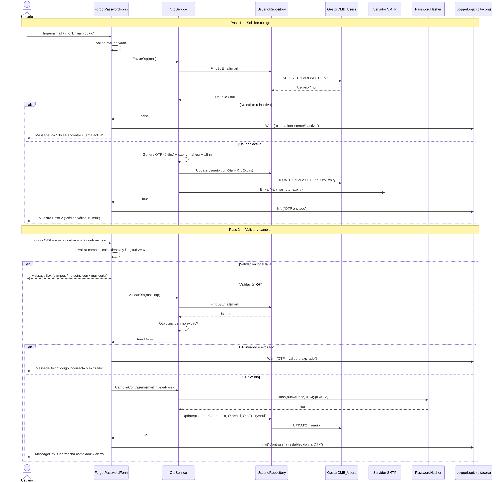

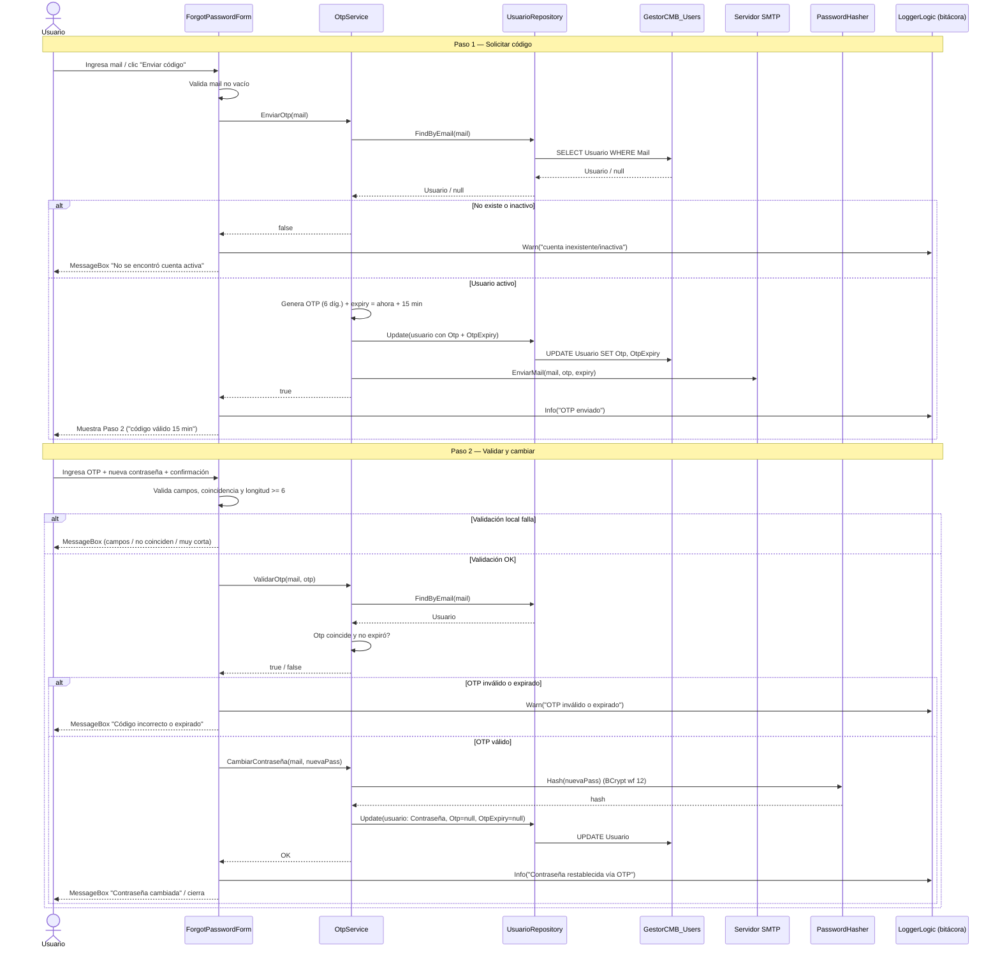
```mermaid
sequenceDiagram
    actor U as Usuario
    participant FP as ForgotPasswordForm
    participant OS as OtpService
    participant UR as UsuarioRepository
    participant DB as GestorCMB_Users
    participant SMTP as Servidor SMTP
    participant PH as PasswordHasher
    participant Log as LoggerLogic (bitácora)

    Note over U,Log: Paso 1 — Solicitar código
    U->>FP: Ingresa mail / clic "Enviar código"
    FP->>FP: Valida mail no vacío
    FP->>OS: EnviarOtp(mail)
    OS->>UR: FindByEmail(mail)
    UR->>DB: SELECT Usuario WHERE Mail
    DB-->>UR: Usuario / null
    UR-->>OS: Usuario / null
    alt No existe o inactivo
        OS-->>FP: false
        FP->>Log: Warn("cuenta inexistente/inactiva")
        FP-->>U: MessageBox "No se encontró cuenta activa"
    else Usuario activo
        OS->>OS: Genera OTP (6 díg.) + expiry = ahora + 15 min
        OS->>UR: Update(usuario con Otp + OtpExpiry)
        UR->>DB: UPDATE Usuario SET Otp, OtpExpiry
        OS->>SMTP: EnviarMail(mail, otp, expiry)
        OS-->>FP: true
        FP->>Log: Info("OTP enviado")
        FP-->>U: Muestra Paso 2 ("código válido 15 min")
    end

    Note over U,Log: Paso 2 — Validar y cambiar
    U->>FP: Ingresa OTP + nueva contraseña + confirmación
    FP->>FP: Valida campos, coincidencia y longitud >= 6
    alt Validación local falla
        FP-->>U: MessageBox (campos / no coinciden / muy corta)
    else Validación OK
        FP->>OS: ValidarOtp(mail, otp)
        OS->>UR: FindByEmail(mail)
        UR-->>OS: Usuario
        OS->>OS: Otp coincide y no expiró?
        OS-->>FP: true / false
        alt OTP inválido o expirado
            FP->>Log: Warn("OTP inválido o expirado")
            FP-->>U: MessageBox "Código incorrecto o expirado"
        else OTP válido
            FP->>OS: CambiarContraseña(mail, nuevaPass)
            OS->>PH: Hash(nuevaPass) (BCrypt wf 12)
            PH-->>OS: hash
            OS->>UR: Update(usuario: Contraseña, Otp=null, OtpExpiry=null)
            UR->>DB: UPDATE Usuario
            OS-->>FP: OK
            FP->>Log: Info("Contraseña restablecida vía OTP")
            FP-->>U: MessageBox "Contraseña cambiada" / cierra
        end
    end
```

---

# 5.2 Gestión de usuarios

## 5.2.1 Crear usuario

**Diseño:** valida campos, verifica que el mail no exista, hashea con BCrypt (wf 12) y opcionalmente asigna un rol inicial (`Usuario_Familia`).

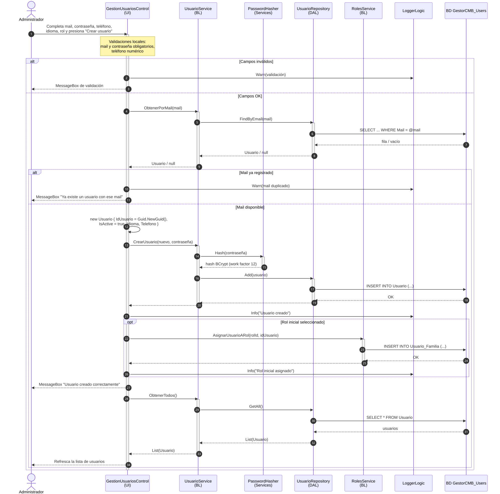

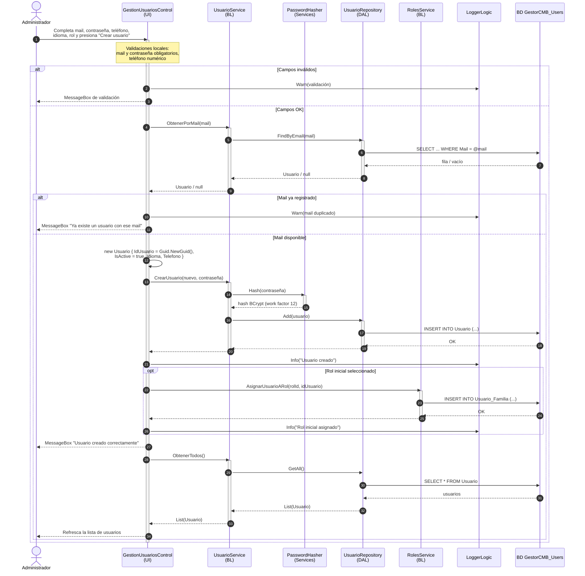
```mermaid
sequenceDiagram
    autonumber
    actor Admin as Administrador
    participant GU as GestionUsuariosControl<br/>(UI)
    participant US as UsuarioService<br/>(BL)
    participant PH as PasswordHasher<br/>(Services)
    participant UR as UsuarioRepository<br/>(DAL)
    participant RS as RolesService<br/>(BL)
    participant LOG as LoggerLogic
    participant DB as BD GestorCMB_Users

    Admin->>GU: Completa mail, contraseña, teléfono,<br/>idioma, rol y presiona "Crear usuario"
    activate GU
    Note over GU: Validaciones locales:<br/>mail y contraseña obligatorios,<br/>teléfono numérico

    alt Campos inválidos
        GU->>LOG: Warn(validación)
        GU-->>Admin: MessageBox de validación
    else Campos OK
        GU->>US: ObtenerPorMail(mail)
        activate US
        US->>UR: FindByEmail(mail)
        activate UR
        UR->>DB: SELECT ... WHERE Mail = @mail
        DB-->>UR: fila / vacío
        UR-->>US: Usuario / null
        deactivate UR
        US-->>GU: Usuario / null
        deactivate US

        alt Mail ya registrado
            GU->>LOG: Warn(mail duplicado)
            GU-->>Admin: MessageBox "Ya existe un usuario con ese mail"
        else Mail disponible
            GU->>GU: new Usuario { IdUsuario = Guid.NewGuid(),<br/>IsActive = true, Idioma, Telefono }
            GU->>US: CrearUsuario(nuevo, contraseña)
            activate US
            US->>PH: Hash(contraseña)
            activate PH
            PH-->>US: hash BCrypt (work factor 12)
            deactivate PH
            US->>UR: Add(usuario)
            activate UR
            UR->>DB: INSERT INTO Usuario (...)
            DB-->>UR: OK
            UR-->>US: 
            deactivate UR
            US-->>GU: 
            deactivate US
            GU->>LOG: Info("Usuario creado")

            opt Rol inicial seleccionado
                GU->>RS: AsignarUsuarioARol(rolId, idUsuario)
                activate RS
                RS->>DB: INSERT INTO Usuario_Familia (...)
                DB-->>RS: OK
                RS-->>GU: 
                deactivate RS
                GU->>LOG: Info("Rol inicial asignado")
            end

            GU-->>Admin: MessageBox "Usuario creado correctamente"
            GU->>US: ObtenerTodos()
            activate US
            US->>UR: GetAll()
            UR->>DB: SELECT * FROM Usuario
            DB-->>UR: usuarios
            UR-->>US: List(Usuario)
            US-->>GU: List(Usuario)
            deactivate US
            GU-->>Admin: Refresca la lista de usuarios
        end
    end
    deactivate GU
```

## 5.2.2 Modificar usuario

**Diseño:** edita datos del usuario. Si el usuario edita **su propio** idioma, guarda la cultura en `Settings` y reinicia la aplicación para aplicarla. La contraseña se guarda tal cual (no se re-hashea en la edición).

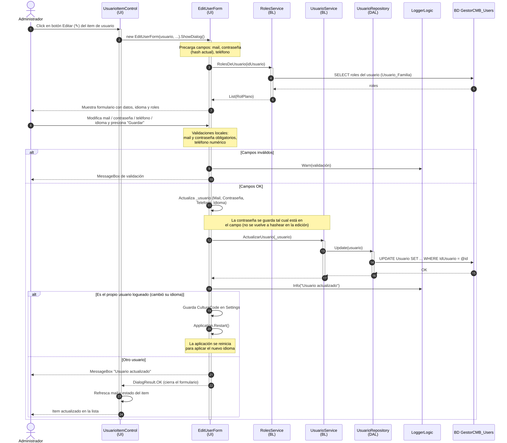

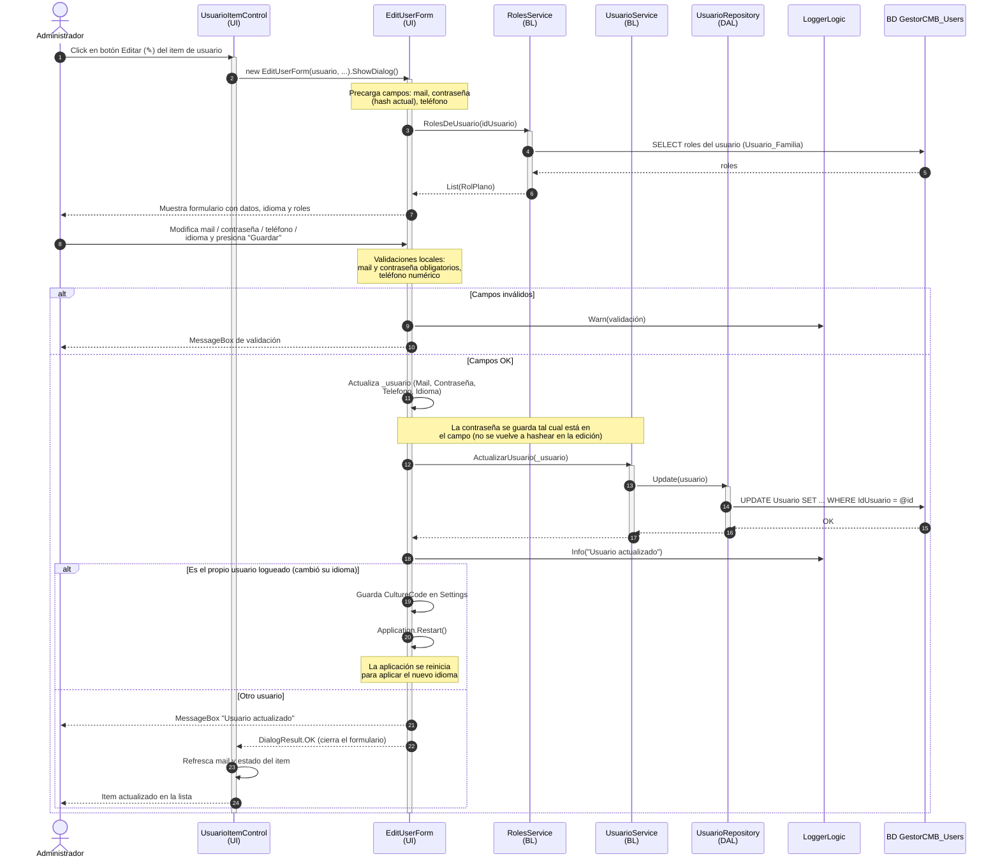
```mermaid
sequenceDiagram
    autonumber
    actor Admin as Administrador
    participant IT as UsuarioItemControl<br/>(UI)
    participant EF as EditUserForm<br/>(UI)
    participant RS as RolesService<br/>(BL)
    participant US as UsuarioService<br/>(BL)
    participant UR as UsuarioRepository<br/>(DAL)
    participant LOG as LoggerLogic
    participant DB as BD GestorCMB_Users

    Admin->>IT: Click en botón Editar (✎) del item de usuario
    activate IT
    IT->>EF: new EditUserForm(usuario, ...).ShowDialog()
    activate EF
    Note over EF: Precarga campos: mail, contraseña<br/>(hash actual), teléfono
    EF->>RS: RolesDeUsuario(idUsuario)
    activate RS
    RS->>DB: SELECT roles del usuario (Usuario_Familia)
    DB-->>RS: roles
    RS-->>EF: List(RolPlano)
    deactivate RS
    EF-->>Admin: Muestra formulario con datos, idioma y roles

    Admin->>EF: Modifica mail / contraseña / teléfono /<br/>idioma y presiona "Guardar"
    Note over EF: Validaciones locales:<br/>mail y contraseña obligatorios,<br/>teléfono numérico

    alt Campos inválidos
        EF->>LOG: Warn(validación)
        EF-->>Admin: MessageBox de validación
    else Campos OK
        EF->>EF: Actualiza _usuario (Mail, Contraseña,<br/>Telefono, Idioma)
        Note over EF,US: La contraseña se guarda tal cual está en<br/>el campo (no se vuelve a hashear en la edición)
        EF->>US: ActualizarUsuario(_usuario)
        activate US
        US->>UR: Update(usuario)
        activate UR
        UR->>DB: UPDATE Usuario SET ... WHERE IdUsuario = @id
        DB-->>UR: OK
        UR-->>US: 
        deactivate UR
        US-->>EF: 
        deactivate US
        EF->>LOG: Info("Usuario actualizado")

        alt Es el propio usuario logueado (cambió su idioma)
            EF->>EF: Guarda CultureCode en Settings
            EF->>EF: Application.Restart()
            Note over EF: La aplicación se reinicia<br/>para aplicar el nuevo idioma
        else Otro usuario
            EF-->>Admin: MessageBox "Usuario actualizado"
            EF-->>IT: DialogResult.OK (cierra el formulario)
            IT->>IT: Refresca mail y estado del item
            IT-->>Admin: Item actualizado en la lista
        end
    end
    deactivate EF
    deactivate IT
```

## 5.2.3 Activar / Desactivar usuario

**Diseño:** baja/alta lógica vía `IsActive` dentro de una Unit of Work. Si la operación falla, la UI **revierte el switch** a su estado anterior.

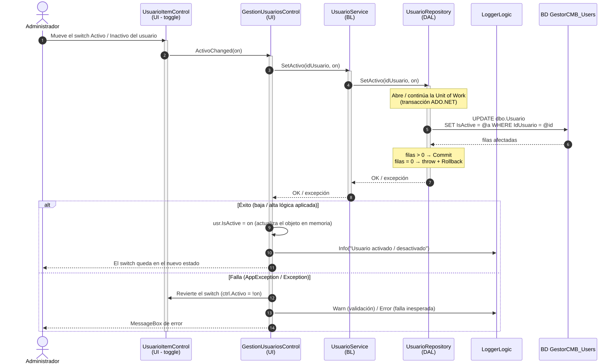

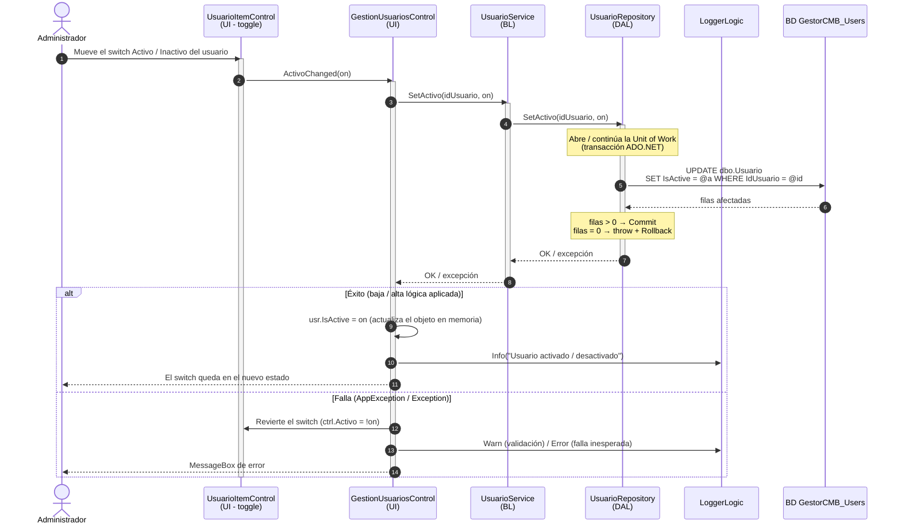
```mermaid
sequenceDiagram
    autonumber
    actor Admin as Administrador
    participant IT as UsuarioItemControl<br/>(UI - toggle)
    participant GU as GestionUsuariosControl<br/>(UI)
    participant US as UsuarioService<br/>(BL)
    participant UR as UsuarioRepository<br/>(DAL)
    participant LOG as LoggerLogic
    participant DB as BD GestorCMB_Users

    Admin->>IT: Mueve el switch Activo / Inactivo del usuario
    activate IT
    IT->>GU: ActivoChanged(on)
    activate GU
    GU->>US: SetActivo(idUsuario, on)
    activate US
    US->>UR: SetActivo(idUsuario, on)
    activate UR
    Note over UR: Abre / continúa la Unit of Work<br/>(transacción ADO.NET)
    UR->>DB: UPDATE dbo.Usuario<br/>SET IsActive = @a WHERE IdUsuario = @id
    DB-->>UR: filas afectadas
    Note over UR: filas > 0 → Commit<br/>filas = 0 → throw + Rollback
    UR-->>US: OK / excepción
    deactivate UR
    US-->>GU: OK / excepción
    deactivate US

    alt Éxito (baja / alta lógica aplicada)
        GU->>GU: usr.IsActive = on (actualiza el objeto en memoria)
        GU->>LOG: Info("Usuario activado / desactivado")
        GU-->>Admin: El switch queda en el nuevo estado
    else Falla (AppException / Exception)
        GU->>IT: Revierte el switch (ctrl.Activo = !on)
        GU->>LOG: Warn (validación) / Error (falla inesperada)
        GU-->>Admin: MessageBox de error
    end
    deactivate GU
    deactivate IT
```

## 5.2.4 Asignar rol a usuario

**Diseño:** vincular un usuario a un rol (`Familia`) hace que **herede todos los accesos** del rol — núcleo del patrón **Composite** RBAC.

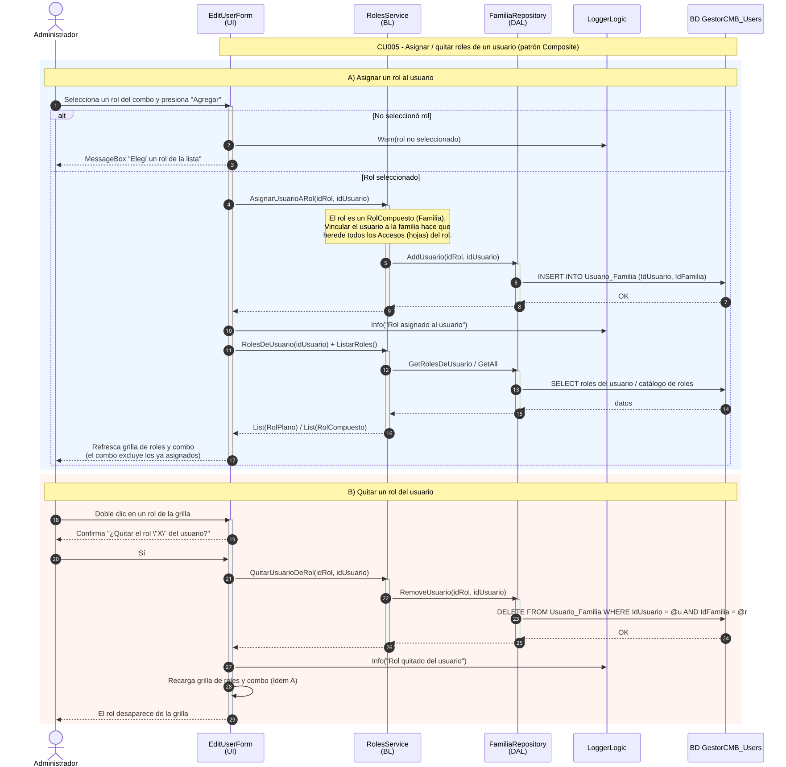

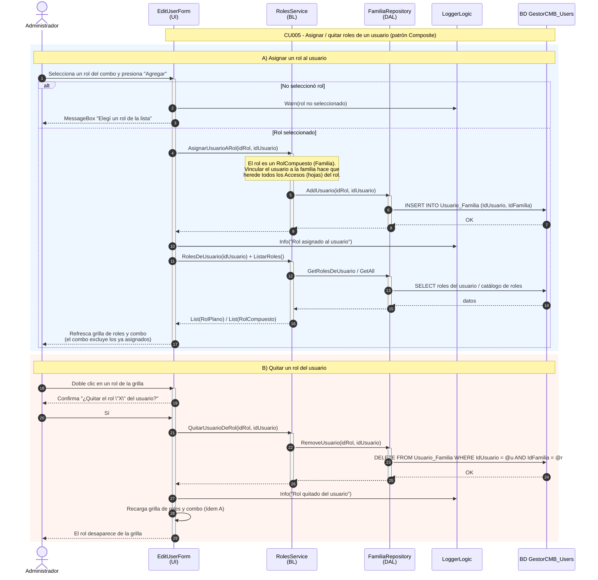
```mermaid
sequenceDiagram
    autonumber
    actor Admin as Administrador
    participant EF as EditUserForm<br/>(UI)
    participant RS as RolesService<br/>(BL)
    participant FR as FamiliaRepository<br/>(DAL)
    participant LOG as LoggerLogic
    participant DB as BD GestorCMB_Users

    Note over EF,DB: CU005 - Asignar / quitar roles de un usuario (patrón Composite)

    rect rgb(238, 246, 255)
    Note over Admin,DB: A) Asignar un rol al usuario
    Admin->>EF: Selecciona un rol del combo y presiona "Agregar"
    activate EF
    alt No seleccionó rol
        EF->>LOG: Warn(rol no seleccionado)
        EF-->>Admin: MessageBox "Elegí un rol de la lista"
    else Rol seleccionado
        EF->>RS: AsignarUsuarioARol(idRol, idUsuario)
        activate RS
        Note over RS: El rol es un RolCompuesto (Familia).<br/>Vincular el usuario a la familia hace que<br/>herede todos los Accesos (hojas) del rol.
        RS->>FR: AddUsuario(idRol, idUsuario)
        activate FR
        FR->>DB: INSERT INTO Usuario_Familia (IdUsuario, IdFamilia)
        DB-->>FR: OK
        FR-->>RS: 
        deactivate FR
        RS-->>EF: 
        deactivate RS
        EF->>LOG: Info("Rol asignado al usuario")
        EF->>RS: RolesDeUsuario(idUsuario) + ListarRoles()
        activate RS
        RS->>FR: GetRolesDeUsuario / GetAll
        activate FR
        FR->>DB: SELECT roles del usuario / catálogo de roles
        DB-->>FR: datos
        FR-->>RS: 
        deactivate FR
        RS-->>EF: List(RolPlano) / List(RolCompuesto)
        deactivate RS
        EF-->>Admin: Refresca grilla de roles y combo<br/>(el combo excluye los ya asignados)
    end
    deactivate EF
    end

    rect rgb(255, 244, 240)
    Note over Admin,DB: B) Quitar un rol del usuario
    Admin->>EF: Doble clic en un rol de la grilla
    activate EF
    EF-->>Admin: Confirma "¿Quitar el rol \"X\" del usuario?"
    Admin->>EF: Sí
    EF->>RS: QuitarUsuarioDeRol(idRol, idUsuario)
    activate RS
    RS->>FR: RemoveUsuario(idRol, idUsuario)
    activate FR
    FR->>DB: DELETE FROM Usuario_Familia WHERE IdUsuario = @u AND IdFamilia = @r
    DB-->>FR: OK
    FR-->>RS: 
    deactivate FR
    RS-->>EF: 
    deactivate RS
    EF->>LOG: Info("Rol quitado del usuario")
    EF->>EF: Recarga grilla de roles y combo (ídem A)
    EF-->>Admin: El rol desaparece de la grilla
    deactivate EF
    end
```

## 5.2.5 Gestionar permisos de un rol

**Diseño:** matriz de toggles VER/GESTIONAR por módulo sobre `Familia_Acceso` (Composite). El rol **Administrador** queda protegido (solo lectura y no se le pueden quitar permisos).

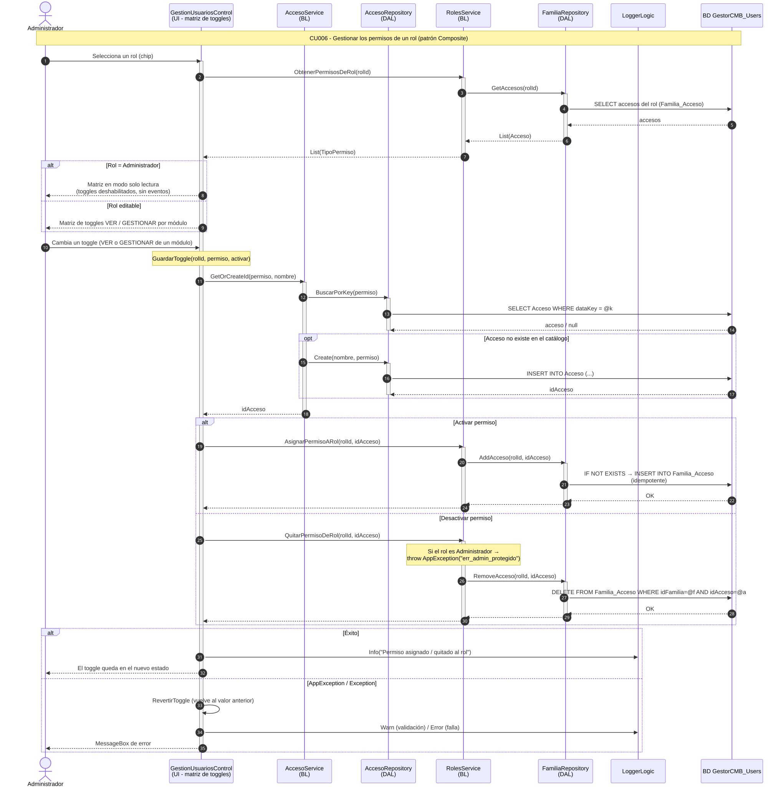

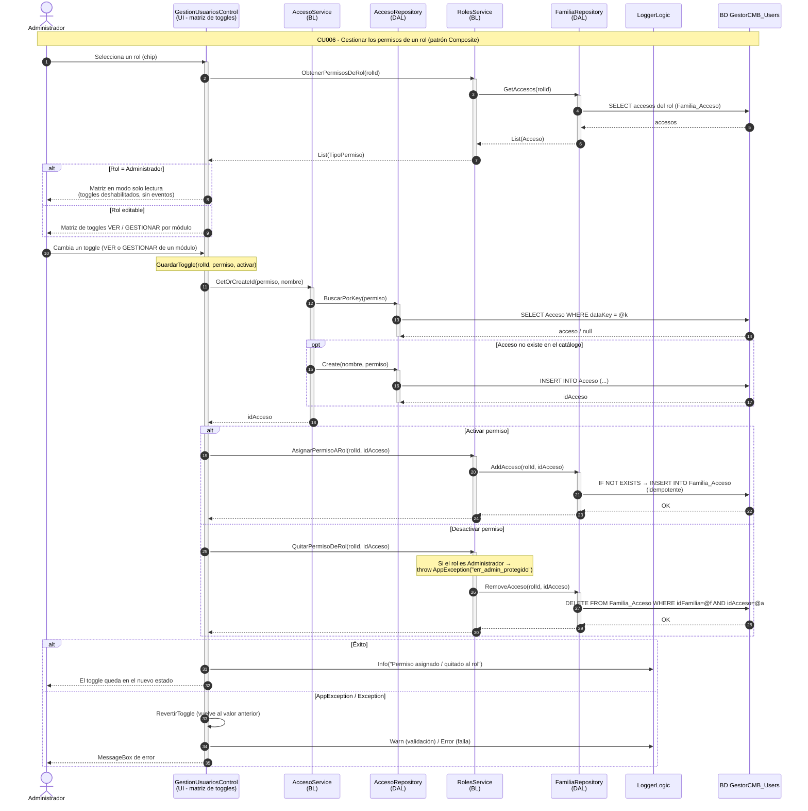
```mermaid
sequenceDiagram
    autonumber
    actor Admin as Administrador
    participant GU as GestionUsuariosControl<br/>(UI - matriz de toggles)
    participant AS as AccesoService<br/>(BL)
    participant AR as AccesoRepository<br/>(DAL)
    participant RS as RolesService<br/>(BL)
    participant FR as FamiliaRepository<br/>(DAL)
    participant LOG as LoggerLogic
    participant DB as BD GestorCMB_Users

    Note over Admin,DB: CU006 - Gestionar los permisos de un rol (patrón Composite)

    Admin->>GU: Selecciona un rol (chip)
    activate GU
    GU->>RS: ObtenerPermisosDeRol(rolId)
    activate RS
    RS->>FR: GetAccesos(rolId)
    activate FR
    FR->>DB: SELECT accesos del rol (Familia_Acceso)
    DB-->>FR: accesos
    FR-->>RS: List(Acceso)
    deactivate FR
    RS-->>GU: List(TipoPermiso)
    deactivate RS
    alt Rol = Administrador
        GU-->>Admin: Matriz en modo solo lectura<br/>(toggles deshabilitados, sin eventos)
    else Rol editable
        GU-->>Admin: Matriz de toggles VER / GESTIONAR por módulo
    end

    Admin->>GU: Cambia un toggle (VER o GESTIONAR de un módulo)
    Note over GU: GuardarToggle(rolId, permiso, activar)

    GU->>AS: GetOrCreateId(permiso, nombre)
    activate AS
    AS->>AR: BuscarPorKey(permiso)
    activate AR
    AR->>DB: SELECT Acceso WHERE dataKey = @k
    DB-->>AR: acceso / null
    deactivate AR
    opt Acceso no existe en el catálogo
        AS->>AR: Create(nombre, permiso)
        activate AR
        AR->>DB: INSERT INTO Acceso (...)
        DB-->>AR: idAcceso
        deactivate AR
    end
    AS-->>GU: idAcceso
    deactivate AS

    alt Activar permiso
        GU->>RS: AsignarPermisoARol(rolId, idAcceso)
        activate RS
        RS->>FR: AddAcceso(rolId, idAcceso)
        activate FR
        FR->>DB: IF NOT EXISTS → INSERT INTO Familia_Acceso<br/>(idempotente)
        DB-->>FR: OK
        FR-->>RS: 
        deactivate FR
        RS-->>GU: 
        deactivate RS
    else Desactivar permiso
        GU->>RS: QuitarPermisoDeRol(rolId, idAcceso)
        activate RS
        Note over RS: Si el rol es Administrador →<br/>throw AppException("err_admin_protegido")
        RS->>FR: RemoveAcceso(rolId, idAcceso)
        activate FR
        FR->>DB: DELETE FROM Familia_Acceso WHERE idFamilia=@f AND idAcceso=@a
        DB-->>FR: OK
        FR-->>RS: 
        deactivate FR
        RS-->>GU: 
        deactivate RS
    end

    alt Éxito
        GU->>LOG: Info("Permiso asignado / quitado al rol")
        GU-->>Admin: El toggle queda en el nuevo estado
    else AppException / Exception
        GU->>GU: RevertirToggle (vuelve al valor anterior)
        GU->>LOG: Warn (validación) / Error (falla)
        GU-->>Admin: MessageBox de error
    end
    deactivate GU
```

## 5.2.6 Crear rol

**Diseño:** crea una nueva `Familia` (rol) que nace como **RolCompuesto vacío**, sin accesos hasta que se gestionen sus permisos.

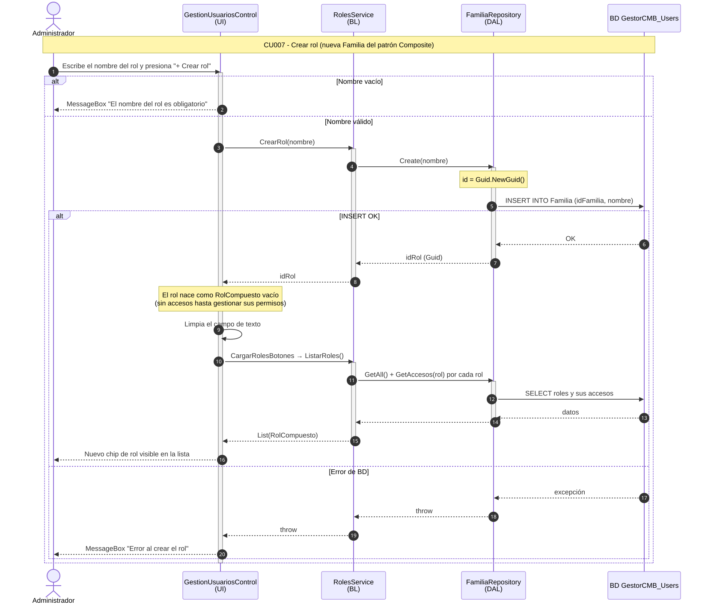

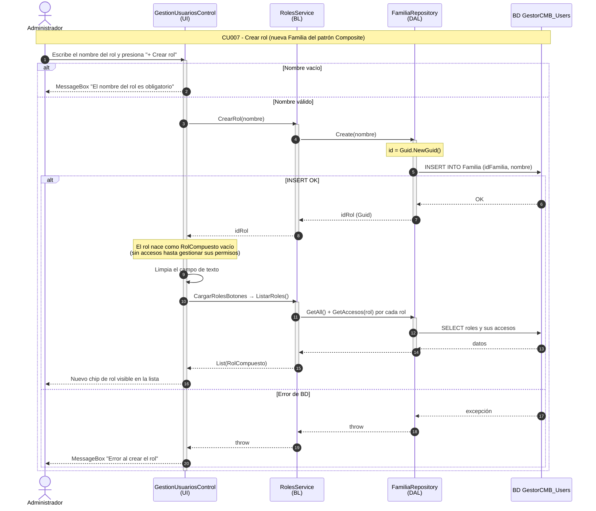
```mermaid
sequenceDiagram
    autonumber
    actor Admin as Administrador
    participant GU as GestionUsuariosControl<br/>(UI)
    participant RS as RolesService<br/>(BL)
    participant FR as FamiliaRepository<br/>(DAL)
    participant DB as BD GestorCMB_Users

    Note over Admin,DB: CU007 - Crear rol (nueva Familia del patrón Composite)

    Admin->>GU: Escribe el nombre del rol y presiona "+ Crear rol"
    activate GU

    alt Nombre vacío
        GU-->>Admin: MessageBox "El nombre del rol es obligatorio"
    else Nombre válido
        GU->>RS: CrearRol(nombre)
        activate RS
        RS->>FR: Create(nombre)
        activate FR
        Note over FR: id = Guid.NewGuid()
        FR->>DB: INSERT INTO Familia (idFamilia, nombre)

        alt INSERT OK
            DB-->>FR: OK
            FR-->>RS: idRol (Guid)
            deactivate FR
            RS-->>GU: idRol
            deactivate RS
            Note over GU: El rol nace como RolCompuesto vacío<br/>(sin accesos hasta gestionar sus permisos)
            GU->>GU: Limpia el campo de texto
            GU->>RS: CargarRolesBotones → ListarRoles()
            activate RS
            RS->>FR: GetAll() + GetAccesos(rol) por cada rol
            activate FR
            FR->>DB: SELECT roles y sus accesos
            DB-->>FR: datos
            FR-->>RS: 
            deactivate FR
            RS-->>GU: List(RolCompuesto)
            deactivate RS
            GU-->>Admin: Nuevo chip de rol visible en la lista
        else Error de BD
            DB-->>FR: excepción
            FR-->>RS: throw
            RS-->>GU: throw
            GU-->>Admin: MessageBox "Error al crear el rol"
        end
    end
    deactivate GU
```

## 5.2.7 Crear permiso / acceso

**Diseño:** crea un `Acceso` (la **hoja** del Composite RBAC). Su `dataKey` (TipoPermiso) es la clave funcional que evalúa `SessionContext.Has(...)` al autorizar.

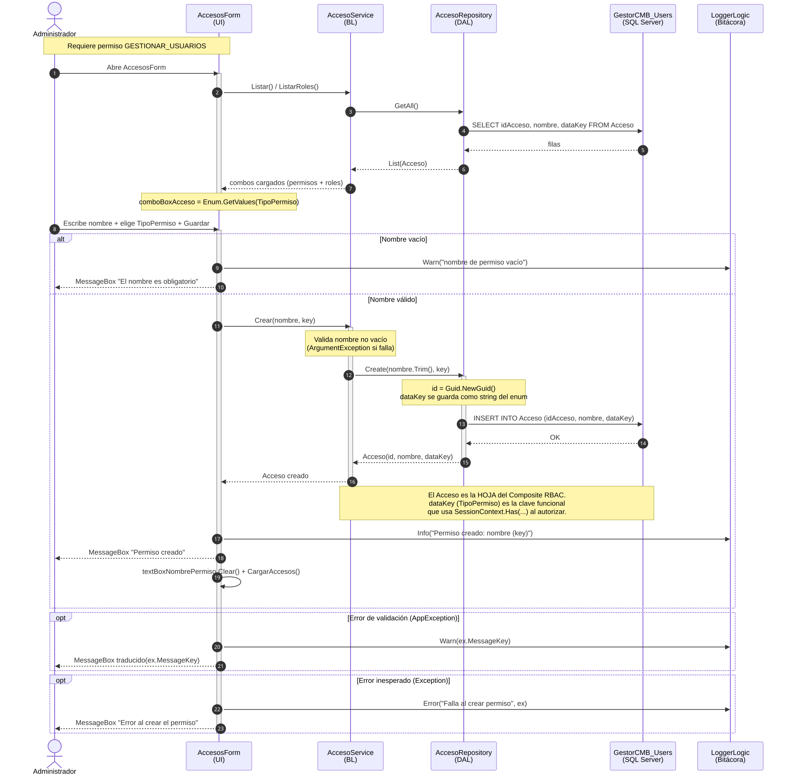

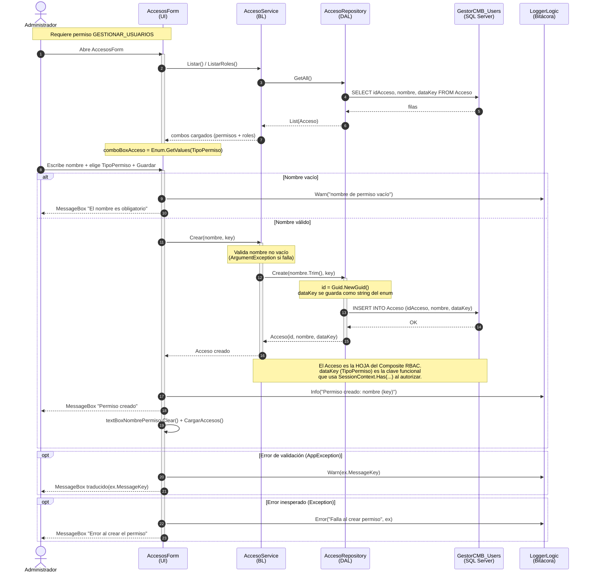
```mermaid
sequenceDiagram
    autonumber
    actor Adm as Administrador
    participant AF as AccesosForm<br/>(UI)
    participant AS as AccesoService<br/>(BL)
    participant AR as AccesoRepository<br/>(DAL)
    participant DB as GestorCMB_Users<br/>(SQL Server)
    participant Log as LoggerLogic<br/>(Bitácora)

    Note over Adm,AF: Requiere permiso GESTIONAR_USUARIOS

    Adm->>AF: Abre AccesosForm
    activate AF
    AF->>AS: Listar() / ListarRoles()
    AS->>AR: GetAll()
    AR->>DB: SELECT idAcceso, nombre, dataKey FROM Acceso
    DB-->>AR: filas
    AR-->>AS: List(Acceso)
    AS-->>AF: combos cargados (permisos + roles)
    Note over AF: comboBoxAcceso = Enum.GetValues(TipoPermiso)
    deactivate AF

    Adm->>AF: Escribe nombre + elige TipoPermiso + Guardar
    activate AF

    alt Nombre vacío
        AF->>Log: Warn("nombre de permiso vacío")
        AF-->>Adm: MessageBox "El nombre es obligatorio"
    else Nombre válido
        AF->>AS: Crear(nombre, key)
        activate AS
        Note over AS: Valida nombre no vacío<br/>(ArgumentException si falla)
        AS->>AR: Create(nombre.Trim(), key)
        activate AR
        Note over AR: id = Guid.NewGuid()<br/>dataKey se guarda como string del enum
        AR->>DB: INSERT INTO Acceso (idAcceso, nombre, dataKey)
        DB-->>AR: OK
        AR-->>AS: Acceso(id, nombre, dataKey)
        deactivate AR
        AS-->>AF: Acceso creado
        deactivate AS

        Note over AS,DB: El Acceso es la HOJA del Composite RBAC.<br/>dataKey (TipoPermiso) es la clave funcional<br/>que usa SessionContext.Has(...) al autorizar.

        AF->>Log: Info("Permiso creado: nombre (key)")
        AF-->>Adm: MessageBox "Permiso creado"
        AF->>AF: textBoxNombrePermiso.Clear() + CargarAccesos()
    end

    opt Error de validación (AppException)
        AF->>Log: Warn(ex.MessageKey)
        AF-->>Adm: MessageBox traducido(ex.MessageKey)
    end
    opt Error inesperado (Exception)
        AF->>Log: Error("Falla al crear permiso", ex)
        AF-->>Adm: MessageBox "Error al crear el permiso"
    end
    deactivate AF
```

## 5.2.8 Cambiar idioma

**Diseño:** el idioma vive en `Usuario.Idioma` (BD) y se materializa en `Settings.CultureCode`. El **Singleton** `LanguageService` aplica la cultura al arrancar y traduce cada Form desde `Resources.resx` (patrón `AplicarTraducciones()`).

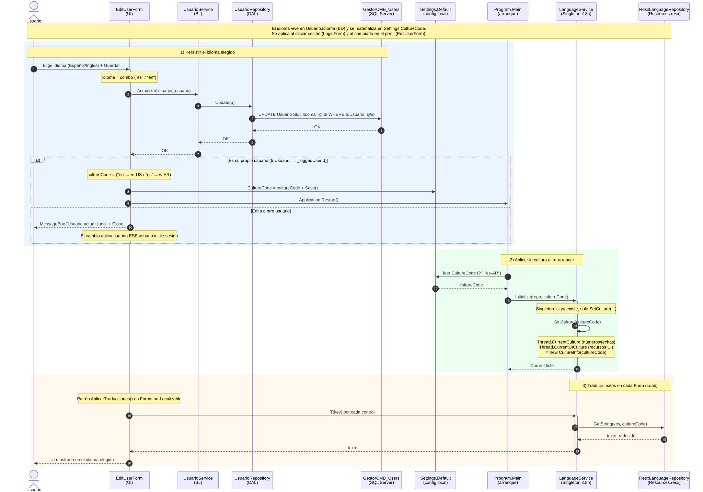

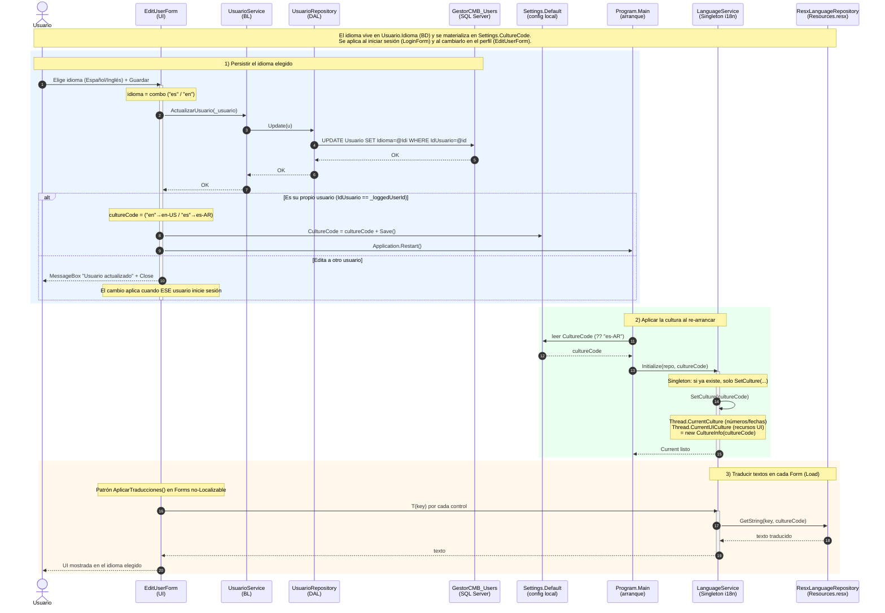
```mermaid
sequenceDiagram
    autonumber
    actor U as Usuario
    participant EUF as EditUserForm<br/>(UI)
    participant US as UsuarioService<br/>(BL)
    participant UR as UsuarioRepository<br/>(DAL)
    participant DB as GestorCMB_Users<br/>(SQL Server)
    participant Cfg as Settings.Default<br/>(config local)
    participant App as Program.Main<br/>(arranque)
    participant LS as LanguageService<br/>(Singleton i18n)
    participant Rx as ResxLanguageRepository<br/>(Resources.resx)

    Note over U,Rx: El idioma vive en Usuario.Idioma (BD) y se materializa en Settings.CultureCode.<br/>Se aplica al iniciar sesión (LoginForm) y al cambiarlo en el perfil (EditUserForm).

    rect rgb(235, 245, 255)
        Note over U,DB: 1) Persistir el idioma elegido
        U->>EUF: Elige idioma (Español/Inglés) + Guardar
        activate EUF
        Note over EUF: idioma = combo ("es" / "en")
        EUF->>US: ActualizarUsuario(_usuario)
        US->>UR: Update(u)
        UR->>DB: UPDATE Usuario SET Idioma=@Idi WHERE IdUsuario=@id
        DB-->>UR: OK
        UR-->>US: OK
        US-->>EUF: OK

        alt Es su propio usuario (IdUsuario == _loggedUserId)
            Note over EUF: cultureCode = ("en"→en-US / "es"→es-AR)
            EUF->>Cfg: CultureCode = cultureCode + Save()
            EUF->>App: Application.Restart()
        else Edita a otro usuario
            EUF-->>U: MessageBox "Usuario actualizado" + Close
            Note over EUF: El cambio aplica cuando ESE usuario inicie sesión
        end
        deactivate EUF
    end

    rect rgb(235, 255, 240)
        Note over App,LS: 2) Aplicar la cultura al re-arrancar
        App->>Cfg: leer CultureCode (?? "es-AR")
        Cfg-->>App: cultureCode
        App->>LS: Initialize(repo, cultureCode)
        activate LS
        Note over LS: Singleton: si ya existe, solo SetCulture(...)
        LS->>LS: SetCulture(cultureCode)
        Note over LS: Thread.CurrentCulture (números/fechas)<br/>Thread.CurrentUICulture (recursos UI)<br/>= new CultureInfo(cultureCode)
        LS-->>App: Current listo
        deactivate LS
    end

    rect rgb(255, 248, 235)
        Note over LS,Rx: 3) Traducir textos en cada Form (Load)
        Note over EUF: Patrón AplicarTraducciones() en Forms no-Localizable
        EUF->>LS: T(key) por cada control
        activate LS
        LS->>Rx: GetString(key, cultureCode)
        Rx-->>LS: texto traducido
        LS-->>EUF: texto
        deactivate LS
        EUF-->>U: UI mostrada en el idioma elegido
    end
```

---

# 5.3 Gestión de clientes

**Diseño:** ABM consolidado sobre el molde EF6 — **Repository + Unit of Work + Factory**. Los writes no llaman `SaveChanges`; lo dispara el `UoW.Commit()`. La baja es **lógica** (`IsActive`), sin DELETE físico.

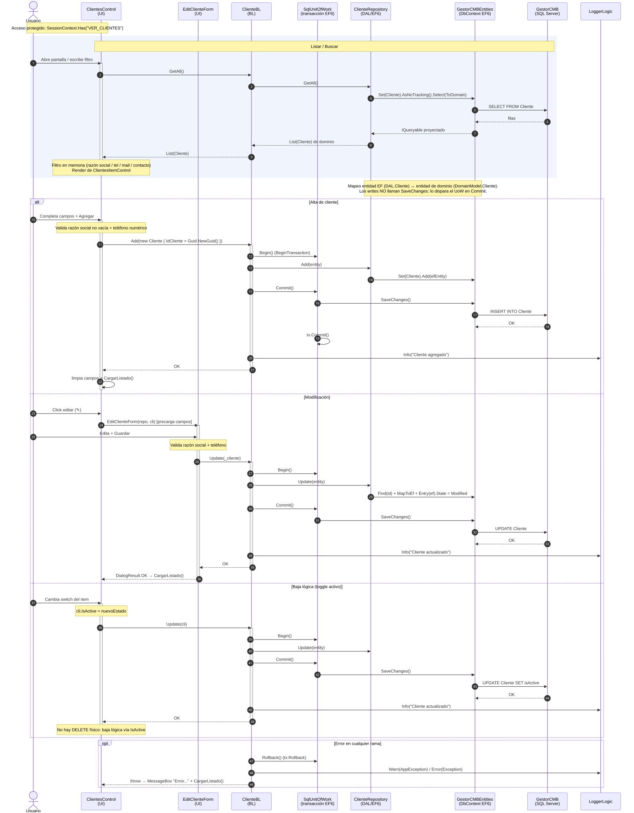

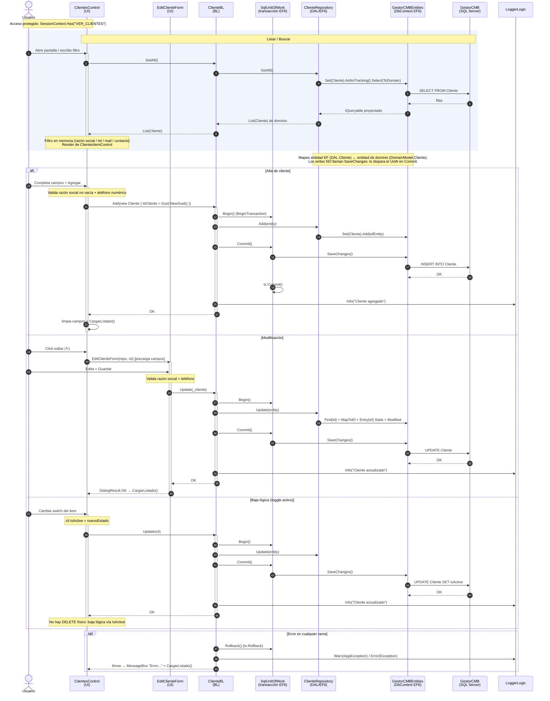
```mermaid
sequenceDiagram
    autonumber
    actor U as Usuario
    participant CC as ClientesControl<br/>(UI)
    participant ECF as EditClienteForm<br/>(UI)
    participant BL as ClienteBL<br/>(BL)
    participant UoW as SqlUnitOfWork<br/>(transacción EF6)
    participant Repo as ClienteRepository<br/>(DAL/EF6)
    participant Ctx as GestorCMBEntities<br/>(DbContext EF6)
    participant DB as GestorCMB<br/>(SQL Server)
    participant Log as LoggerLogic

    Note over U,CC: Acceso protegido: SessionContext.Has("VER_CLIENTES")

    rect rgb(240, 244, 252)
        Note over CC,DB: Listar / Buscar
        U->>CC: Abre pantalla / escribe filtro
        activate CC
        CC->>BL: GetAll()
        BL->>Repo: GetAll()
        Repo->>Ctx: Set(Cliente).AsNoTracking().Select(ToDomain)
        Ctx->>DB: SELECT FROM Cliente
        DB-->>Ctx: filas
        Ctx-->>Repo: IQueryable proyectado
        Repo-->>BL: List(Cliente) de dominio
        BL-->>CC: List(Cliente)
        Note over CC: Filtro en memoria (razón social / tel / mail / contacto)<br/>Render de ClientesItemControl
        deactivate CC
    end

    Note over Repo,Ctx: Mapeo entidad EF (DAL.Cliente) ↔ entidad de dominio (DomainModel.Cliente).<br/>Los writes NO llaman SaveChanges: lo dispara el UoW en Commit.

    alt Alta de cliente
        U->>CC: Completa campos + Agregar
        activate CC
        Note over CC: Valida razón social no vacía + teléfono numérico
        CC->>BL: Add(new Cliente { IdCliente = Guid.NewGuid() })
        activate BL
        BL->>UoW: Begin() (BeginTransaction)
        BL->>Repo: Add(entity)
        Repo->>Ctx: Set(Cliente).Add(efEntity)
        BL->>UoW: Commit()
        UoW->>Ctx: SaveChanges()
        Ctx->>DB: INSERT INTO Cliente
        DB-->>Ctx: OK
        UoW->>UoW: tx.Commit()
        BL->>Log: Info("Cliente agregado")
        BL-->>CC: OK
        deactivate BL
        CC->>CC: limpia campos + CargarListado()
        deactivate CC

    else Modificación
        U->>CC: Click editar (✎)
        CC->>ECF: EditClienteForm(repo, cli) [precarga campos]
        activate ECF
        U->>ECF: Edita + Guardar
        Note over ECF: Valida razón social + teléfono
        ECF->>BL: Update(_cliente)
        activate BL
        BL->>UoW: Begin()
        BL->>Repo: Update(entity)
        Repo->>Ctx: Find(id) + MapToEf + Entry(ef).State = Modified
        BL->>UoW: Commit()
        UoW->>Ctx: SaveChanges()
        Ctx->>DB: UPDATE Cliente
        DB-->>Ctx: OK
        BL->>Log: Info("Cliente actualizado")
        BL-->>ECF: OK
        deactivate BL
        ECF-->>CC: DialogResult.OK → CargarListado()
        deactivate ECF

    else Baja lógica (toggle activo)
        U->>CC: Cambia switch del item
        activate CC
        Note over CC: cli.IsActive = nuevoEstado
        CC->>BL: Update(cli)
        activate BL
        BL->>UoW: Begin()
        BL->>Repo: Update(entity)
        BL->>UoW: Commit()
        UoW->>Ctx: SaveChanges()
        Ctx->>DB: UPDATE Cliente SET isActive
        DB-->>Ctx: OK
        BL->>Log: Info("Cliente actualizado")
        BL-->>CC: OK
        deactivate BL
        Note over CC: No hay DELETE físico: baja lógica vía IsActive
        deactivate CC
    end

    opt Error en cualquier rama
        BL->>UoW: Rollback() (tx.Rollback)
        BL->>Log: Warn(AppException) / Error(Exception)
        BL-->>CC: throw → MessageBox "Error..." + CargarListado()
    end
```

---

# 5.4 Gestión de empleados

**Diseño:** mismo molde EF6 que clientes, con **doble permiso**: `VER_EMPLEADOS` para la pantalla y `GESTIONAR_EMPLEADOS` para alta/edición. Incluye `CantidadProyectosActivos` (derivado).

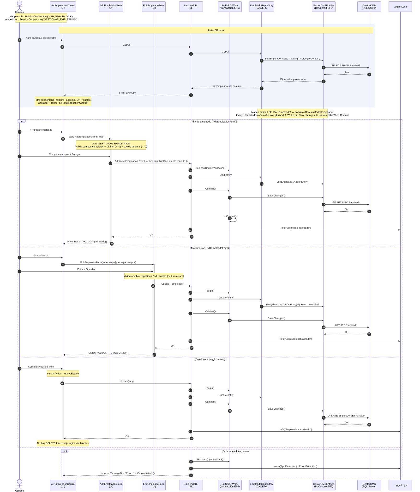

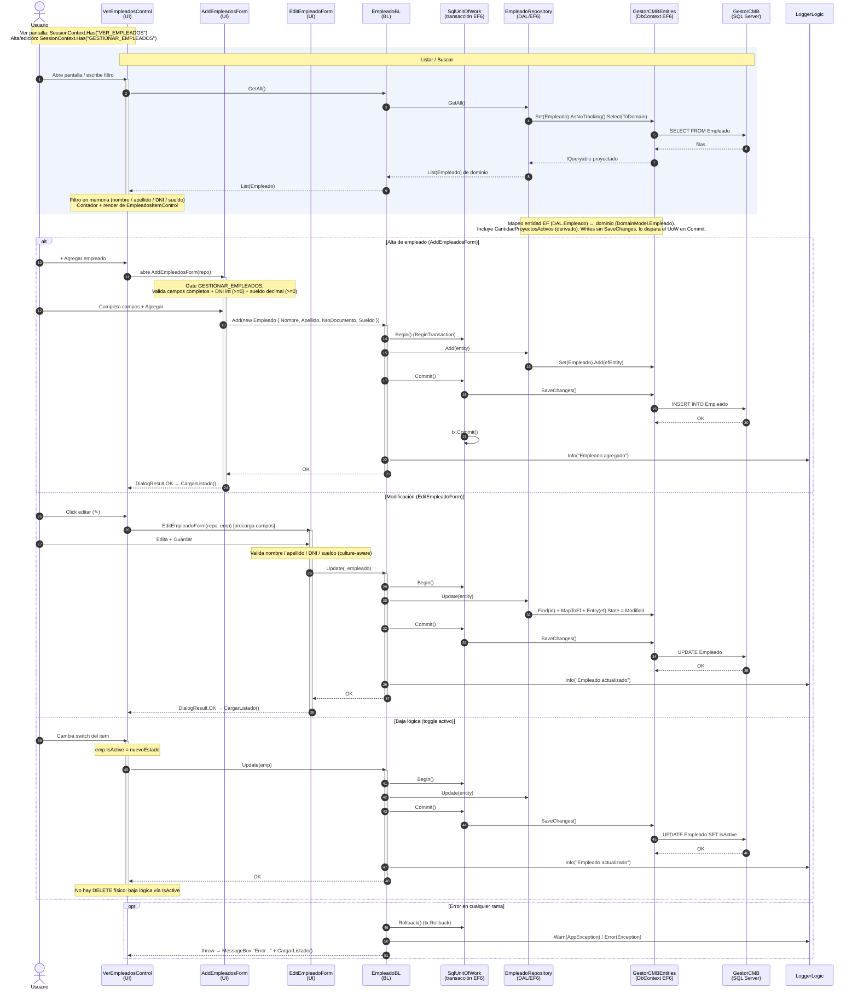
```mermaid
sequenceDiagram
    autonumber
    actor U as Usuario
    participant VC as VerEmpleadosControl<br/>(UI)
    participant AF as AddEmpleadosForm<br/>(UI)
    participant EF as EditEmpleadoForm<br/>(UI)
    participant BL as EmpleadoBL<br/>(BL)
    participant UoW as SqlUnitOfWork<br/>(transacción EF6)
    participant Repo as EmpleadoRepository<br/>(DAL/EF6)
    participant Ctx as GestorCMBEntities<br/>(DbContext EF6)
    participant DB as GestorCMB<br/>(SQL Server)
    participant Log as LoggerLogic

    Note over U,VC: Ver pantalla: SessionContext.Has("VER_EMPLEADOS")<br/>Alta/edición: SessionContext.Has("GESTIONAR_EMPLEADOS")

    rect rgb(240, 244, 252)
        Note over VC,DB: Listar / Buscar
        U->>VC: Abre pantalla / escribe filtro
        activate VC
        VC->>BL: GetAll()
        BL->>Repo: GetAll()
        Repo->>Ctx: Set(Empleado).AsNoTracking().Select(ToDomain)
        Ctx->>DB: SELECT FROM Empleado
        DB-->>Ctx: filas
        Ctx-->>Repo: IQueryable proyectado
        Repo-->>BL: List(Empleado) de dominio
        BL-->>VC: List(Empleado)
        Note over VC: Filtro en memoria (nombre / apellido / DNI / sueldo)<br/>Contador + render de EmpleadosItemControl
        deactivate VC
    end

    Note over Repo,Ctx: Mapeo entidad EF (DAL.Empleado) ↔ dominio (DomainModel.Empleado).<br/>Incluye CantidadProyectosActivos (derivado). Writes sin SaveChanges: lo dispara el UoW en Commit.

    alt Alta de empleado (AddEmpleadosForm)
        U->>VC: + Agregar empleado
        VC->>AF: abre AddEmpleadosForm(repo)
        activate AF
        Note over AF: Gate GESTIONAR_EMPLEADOS.<br/>Valida campos completos + DNI int (>=0) + sueldo decimal (>=0)
        U->>AF: Completa campos + Agregar
        AF->>BL: Add(new Empleado { Nombre, Apellido, NroDocumento, Sueldo })
        activate BL
        BL->>UoW: Begin() (BeginTransaction)
        BL->>Repo: Add(entity)
        Repo->>Ctx: Set(Empleado).Add(efEntity)
        BL->>UoW: Commit()
        UoW->>Ctx: SaveChanges()
        Ctx->>DB: INSERT INTO Empleado
        DB-->>Ctx: OK
        UoW->>UoW: tx.Commit()
        BL->>Log: Info("Empleado agregado")
        BL-->>AF: OK
        deactivate BL
        AF-->>VC: DialogResult.OK → CargarListado()
        deactivate AF

    else Modificación (EditEmpleadoForm)
        U->>VC: Click editar (✎)
        VC->>EF: EditEmpleadoForm(repo, emp) [precarga campos]
        activate EF
        U->>EF: Edita + Guardar
        Note over EF: Valida nombre / apellido / DNI / sueldo (culture-aware)
        EF->>BL: Update(_empleado)
        activate BL
        BL->>UoW: Begin()
        BL->>Repo: Update(entity)
        Repo->>Ctx: Find(id) + MapToEf + Entry(ef).State = Modified
        BL->>UoW: Commit()
        UoW->>Ctx: SaveChanges()
        Ctx->>DB: UPDATE Empleado
        DB-->>Ctx: OK
        BL->>Log: Info("Empleado actualizado")
        BL-->>EF: OK
        deactivate BL
        EF-->>VC: DialogResult.OK → CargarListado()
        deactivate EF

    else Baja lógica (toggle activo)
        U->>VC: Cambia switch del item
        activate VC
        Note over VC: emp.IsActive = nuevoEstado
        VC->>BL: Update(emp)
        activate BL
        BL->>UoW: Begin()
        BL->>Repo: Update(entity)
        BL->>UoW: Commit()
        UoW->>Ctx: SaveChanges()
        Ctx->>DB: UPDATE Empleado SET isActive
        DB-->>Ctx: OK
        BL->>Log: Info("Empleado actualizado")
        BL-->>VC: OK
        deactivate BL
        Note over VC: No hay DELETE físico: baja lógica vía IsActive
        deactivate VC
    end

    opt Error en cualquier rama
        BL->>UoW: Rollback() (tx.Rollback)
        BL->>Log: Warn(AppException) / Error(Exception)
        BL-->>VC: throw → MessageBox "Error..." + CargarListado()
    end
```

---

# 5.5 Gestión de informes de compra

## 5.5.1 Administrar materiales faltantes (origen del flujo)

**Diseño:** el flujo de compra arranca acá. `AddOrUpdate` hace **upsert acumulativo** (suma cantidades del mismo material). Luego `GenerarDesdeFaltantes` crea el informe de forma **idempotente** (único por día).

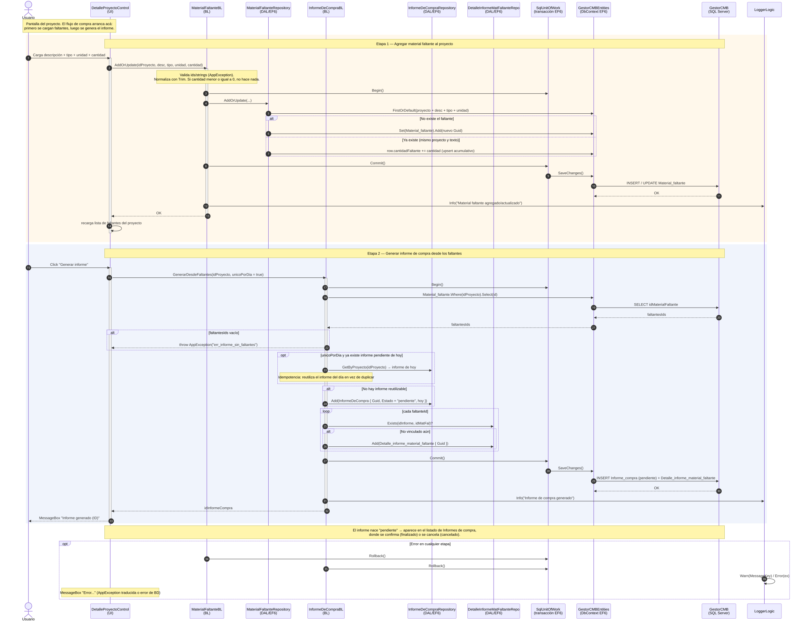

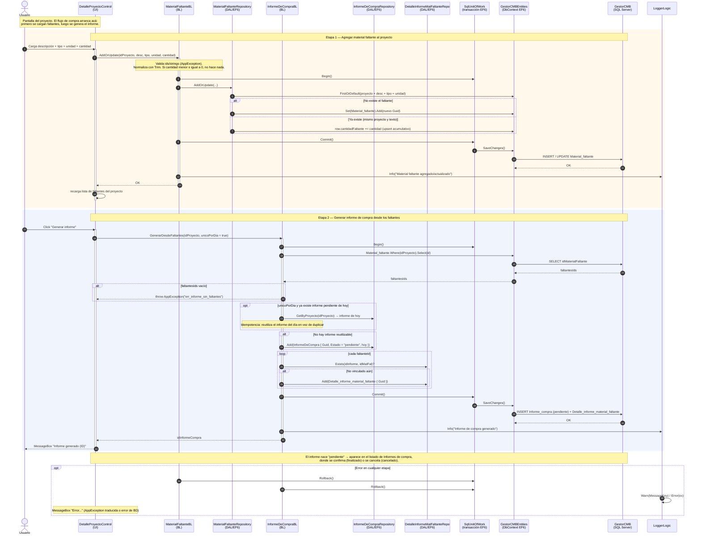
```mermaid
sequenceDiagram
    autonumber
    actor U as Usuario
    participant DPC as DetalleProyectoControl<br/>(UI)
    participant MFB as MaterialFaltanteBL<br/>(BL)
    participant MFR as MaterialFaltanteRepository<br/>(DAL/EF6)
    participant IBL as InformeDeCompraBL<br/>(BL)
    participant ICR as InformeDeCompraRepository<br/>(DAL/EF6)
    participant DIR as DetalleInformeMatFaltanteRepo<br/>(DAL/EF6)
    participant UoW as SqlUnitOfWork<br/>(transacción EF6)
    participant Ctx as GestorCMBEntities<br/>(DbContext EF6)
    participant DB as GestorCMB<br/>(SQL Server)
    participant Log as LoggerLogic

    Note over U,DPC: Pantalla del proyecto. El flujo de compra arranca acá:<br/>primero se cargan faltantes, luego se genera el informe.

    rect rgb(255, 248, 235)
        Note over DPC,DB: Etapa 1 — Agregar material faltante al proyecto
        U->>DPC: Carga descripción + tipo + unidad + cantidad
        activate DPC
        DPC->>MFB: AddOrUpdate(idProyecto, desc, tipo, unidad, cantidad)
        activate MFB
        Note over MFB: Valida ids/strings (AppException).<br/>Normaliza con Trim. Si cantidad menor o igual a 0, no hace nada.
        MFB->>UoW: Begin()
        MFB->>MFR: AddOrUpdate(...)
        MFR->>Ctx: FirstOrDefault(proyecto + desc + tipo + unidad)
        alt No existe el faltante
            MFR->>Ctx: Set(Material_faltante).Add(nuevo Guid)
        else Ya existe (mismo proyecto y texto)
            MFR->>Ctx: row.cantidadFaltante += cantidad (upsert acumulativo)
        end
        MFB->>UoW: Commit()
        UoW->>Ctx: SaveChanges()
        Ctx->>DB: INSERT / UPDATE Material_faltante
        DB-->>Ctx: OK
        MFB->>Log: Info("Material faltante agregado/actualizado")
        MFB-->>DPC: OK
        deactivate MFB
        DPC->>DPC: recarga lista de faltantes del proyecto
        deactivate DPC
    end

    rect rgb(240, 244, 252)
        Note over DPC,DB: Etapa 2 — Generar informe de compra desde los faltantes
        U->>DPC: Click "Generar informe"
        activate DPC
        DPC->>IBL: GenerarDesdeFaltantes(idProyecto, unicoPorDia = true)
        activate IBL
        IBL->>UoW: Begin()
        IBL->>Ctx: Material_faltante.Where(idProyecto).Select(id)
        Ctx->>DB: SELECT idMaterialFaltante
        DB-->>Ctx: faltantesIds
        Ctx-->>IBL: faltantesIds
        alt faltantesIds vacío
            IBL-->>DPC: throw AppException("err_informe_sin_faltantes")
        end
        opt unicoPorDia y ya existe informe pendiente de hoy
            IBL->>ICR: GetByProyecto(idProyecto) → informe de hoy
            Note over IBL: Idempotencia: reutiliza el informe del día en vez de duplicar
        end
        alt No hay informe reutilizable
            IBL->>ICR: Add(InformeDeCompra { Guid, Estado = "pendiente", hoy })
        end
        loop cada faltanteId
            IBL->>DIR: Exists(idInforme, idMatFal)?
            alt No vinculado aún
                IBL->>DIR: Add(Detalle_informe_material_faltante { Guid })
            end
        end
        IBL->>UoW: Commit()
        UoW->>Ctx: SaveChanges()
        Ctx->>DB: INSERT Informe_compra (pendiente) + Detalle_informe_material_faltante
        DB-->>Ctx: OK
        IBL->>Log: Info("Informe de compra generado")
        IBL-->>DPC: idInformeCompra
        deactivate IBL
        DPC-->>U: MessageBox "Informe generado (ID)"
        deactivate DPC
    end

    Note over DPC,DB: El informe nace "pendiente" → aparece en el listado de Informes de compra,<br/>donde se confirma (finalizado) o se cancela (cancelado).

    opt Error en cualquier etapa
        MFB->>UoW: Rollback()
        IBL->>UoW: Rollback()
        Log->>Log: Warn(MessageKey) / Error(ex)
        Note over DPC: MessageBox "Error..." (AppException traducida o error de BD)
    end
```

## 5.5.2 Confirmar informe de compra

**Diseño:** aplica la compra al inventario del proyecto. Matchea `Material_faltante` contra `Material` **por texto** (descripción + tipo + unidad), upsert acumulativo en el detalle, guarda un **snapshot** del historial en archivo y cierra estados (informe → finalizado, viejos huérfanos → cancelado). Todo en una sola transacción.

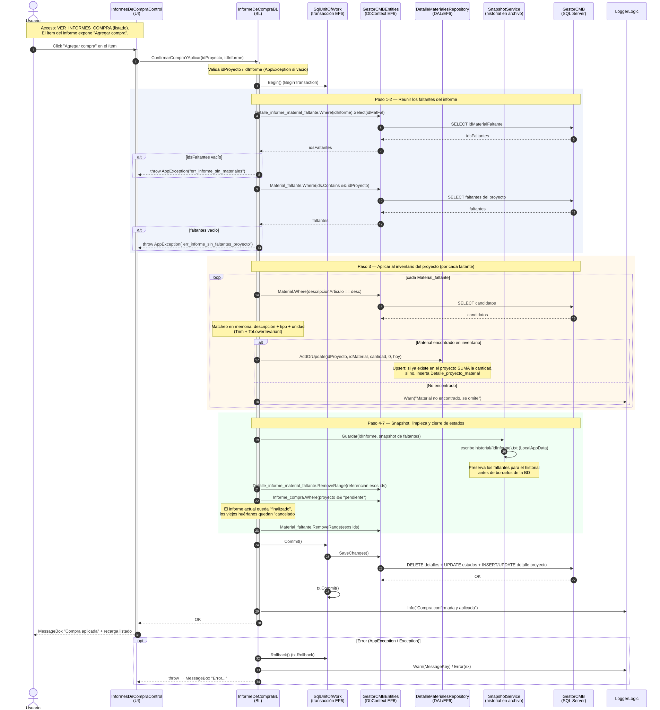

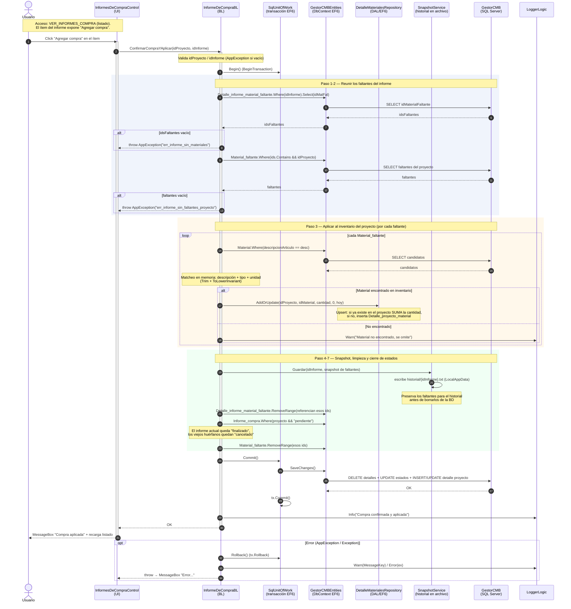
```mermaid
sequenceDiagram
    autonumber
    actor U as Usuario
    participant IC as InformesDeCompraControl<br/>(UI)
    participant BL as InformeDeCompraBL<br/>(BL)
    participant UoW as SqlUnitOfWork<br/>(transacción EF6)
    participant Ctx as GestorCMBEntities<br/>(DbContext EF6)
    participant DMR as DetalleMaterialesRepository<br/>(DAL/EF6)
    participant Snap as SnapshotService<br/>(historial en archivo)
    participant DB as GestorCMB<br/>(SQL Server)
    participant Log as LoggerLogic

    Note over U,IC: Acceso: VER_INFORMES_COMPRA (listado).<br/>El ítem del informe expone "Agregar compra".

    U->>IC: Click "Agregar compra" en el ítem
    activate IC
    IC->>BL: ConfirmarCompraYAplicar(idProyecto, idInforme)
    activate BL
    Note over BL: Valida idProyecto / idInforme (AppException si vacío)
    BL->>UoW: Begin() (BeginTransaction)

    rect rgb(240, 244, 252)
        Note over BL,DB: Paso 1-2 — Reunir los faltantes del informe
        BL->>Ctx: Detalle_informe_material_faltante.Where(idInforme).Select(idMatFal)
        Ctx->>DB: SELECT idMaterialFaltante
        DB-->>Ctx: idsFaltantes
        Ctx-->>BL: idsFaltantes
        alt idsFaltantes vacío
            BL-->>IC: throw AppException("err_informe_sin_materiales")
        end
        BL->>Ctx: Material_faltante.Where(ids.Contains && idProyecto)
        Ctx->>DB: SELECT faltantes del proyecto
        DB-->>Ctx: faltantes
        Ctx-->>BL: faltantes
        alt faltantes vacío
            BL-->>IC: throw AppException("err_informe_sin_faltantes_proyecto")
        end
    end

    rect rgb(255, 248, 235)
        Note over BL,DB: Paso 3 — Aplicar al inventario del proyecto (por cada faltante)
        loop cada Material_faltante
            BL->>Ctx: Material.Where(descripcionArticulo == desc)
            Ctx->>DB: SELECT candidatos
            DB-->>Ctx: candidatos
            Note over BL: Matcheo en memoria: descripción + tipo + unidad<br/>(Trim + ToLowerInvariant)
            alt Material encontrado en inventario
                BL->>DMR: AddOrUpdate(idProyecto, idMaterial, cantidad, 0, hoy)
                Note over DMR: Upsert: si ya existe en el proyecto SUMA la cantidad,<br/>si no, inserta Detalle_proyecto_material
            else No encontrado
                BL->>Log: Warn("Material no encontrado, se omite")
            end
        end
    end

    rect rgb(240, 255, 244)
        Note over BL,DB: Paso 4-7 — Snapshot, limpieza y cierre de estados
        BL->>Snap: Guardar(idInforme, snapshot de faltantes)
        Snap->>Snap: escribe historial/{idInforme}.txt (LocalAppData)
        Note over Snap: Preserva los faltantes para el historial<br/>antes de borrarlos de la BD
        BL->>Ctx: Detalle_informe_material_faltante.RemoveRange(referencian esos ids)
        BL->>Ctx: Informe_compra.Where(proyecto && "pendiente")
        Note over BL: El informe actual queda "finalizado",<br/>los viejos huérfanos quedan "cancelado"
        BL->>Ctx: Material_faltante.RemoveRange(esos ids)
    end

    BL->>UoW: Commit()
    UoW->>Ctx: SaveChanges()
    Ctx->>DB: DELETE detalles + UPDATE estados + INSERT/UPDATE detalle proyecto
    DB-->>Ctx: OK
    UoW->>UoW: tx.Commit()
    BL->>Log: Info("Compra confirmada y aplicada")
    BL-->>IC: OK
    deactivate BL
    IC-->>U: MessageBox "Compra aplicada" + recarga listado
    deactivate IC

    opt Error (AppException / Exception)
        BL->>UoW: Rollback() (tx.Rollback)
        BL->>Log: Warn(MessageKey) / Error(ex)
        BL-->>IC: throw → MessageBox "Error..."
    end
```

## 5.5.3 Administrar informes de compra

**Diseño:** lista solo los informes **pendientes** (agrupados por proyecto). "Eliminar" es **baja lógica por estado** (`cancelado`): el informe sale del listado y pasa al historial.

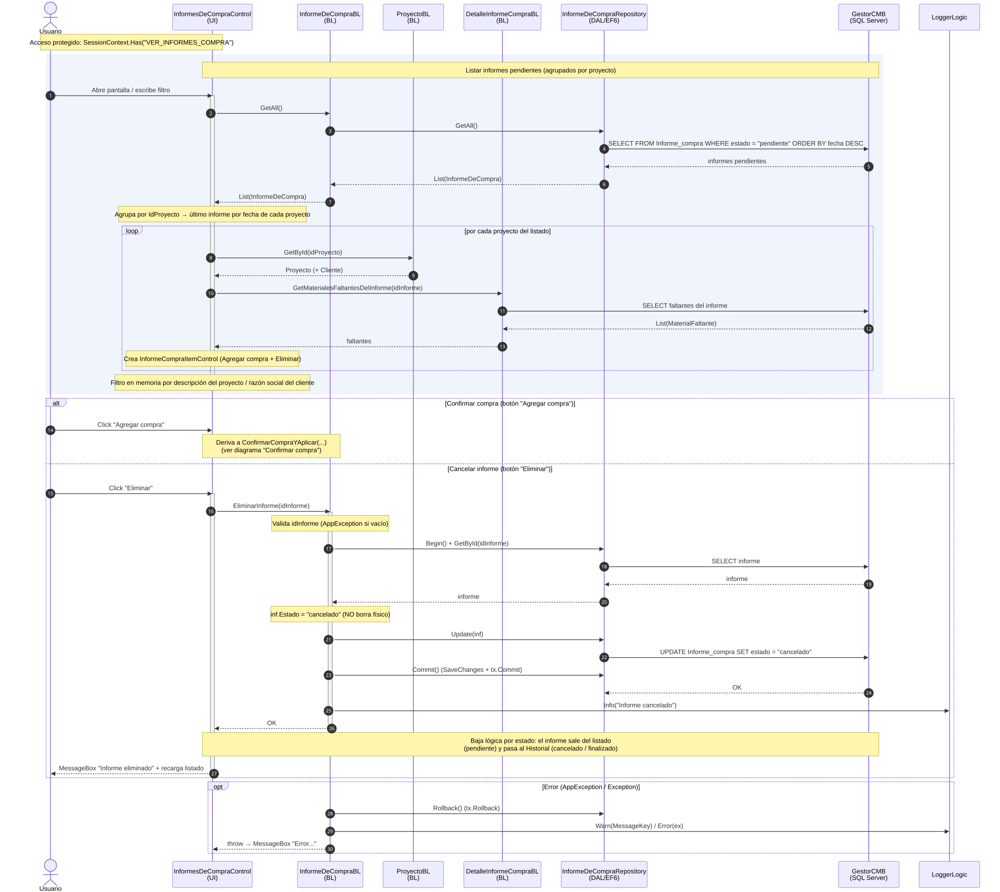

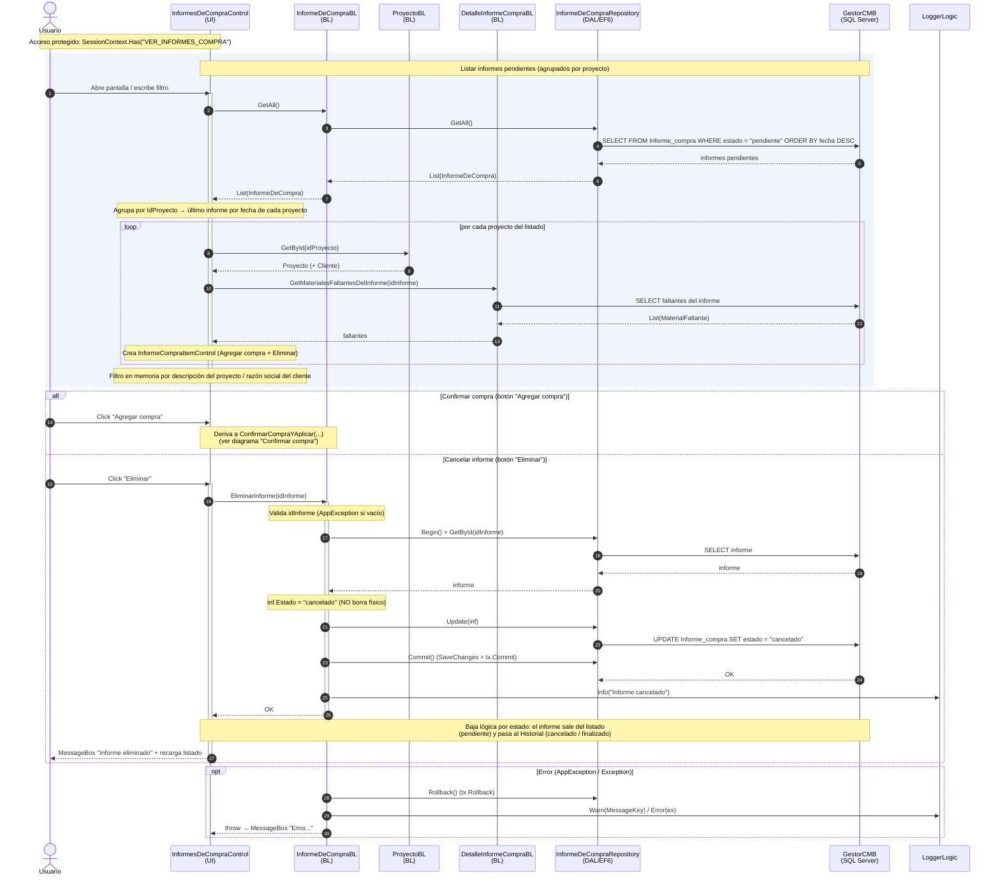
```mermaid
sequenceDiagram
    autonumber
    actor U as Usuario
    participant IC as InformesDeCompraControl<br/>(UI)
    participant IBL as InformeDeCompraBL<br/>(BL)
    participant PBL as ProyectoBL<br/>(BL)
    participant DBL as DetalleInformeCompraBL<br/>(BL)
    participant Repo as InformeDeCompraRepository<br/>(DAL/EF6)
    participant DB as GestorCMB<br/>(SQL Server)
    participant Log as LoggerLogic

    Note over U,IC: Acceso protegido: SessionContext.Has("VER_INFORMES_COMPRA")

    rect rgb(240, 244, 252)
        Note over IC,DB: Listar informes pendientes (agrupados por proyecto)
        U->>IC: Abre pantalla / escribe filtro
        activate IC
        IC->>IBL: GetAll()
        IBL->>Repo: GetAll()
        Repo->>DB: SELECT FROM Informe_compra WHERE estado = "pendiente" ORDER BY fecha DESC
        DB-->>Repo: informes pendientes
        Repo-->>IBL: List(InformeDeCompra)
        IBL-->>IC: List(InformeDeCompra)
        Note over IC: Agrupa por IdProyecto → último informe por fecha de cada proyecto
        loop por cada proyecto del listado
            IC->>PBL: GetById(idProyecto)
            PBL-->>IC: Proyecto (+ Cliente)
            IC->>DBL: GetMaterialesFaltantesDelInforme(idInforme)
            DBL->>DB: SELECT faltantes del informe
            DB-->>DBL: List(MaterialFaltante)
            DBL-->>IC: faltantes
            Note over IC: Crea InformeCompraItemControl (Agregar compra + Eliminar)
        end
        Note over IC: Filtro en memoria por descripción del proyecto / razón social del cliente
        deactivate IC
    end

    alt Confirmar compra (botón "Agregar compra")
        U->>IC: Click "Agregar compra"
        Note over IC,IBL: Deriva a ConfirmarCompraYAplicar(...)<br/>(ver diagrama "Confirmar compra")
    else Cancelar informe (botón "Eliminar")
        U->>IC: Click "Eliminar"
        activate IC
        IC->>IBL: EliminarInforme(idInforme)
        activate IBL
        Note over IBL: Valida idInforme (AppException si vacío)
        IBL->>Repo: Begin() + GetById(idInforme)
        Repo->>DB: SELECT informe
        DB-->>Repo: informe
        Repo-->>IBL: informe
        Note over IBL: inf.Estado = "cancelado" (NO borra físico)
        IBL->>Repo: Update(inf)
        Repo->>DB: UPDATE Informe_compra SET estado = "cancelado"
        IBL->>Repo: Commit() (SaveChanges + tx.Commit)
        DB-->>Repo: OK
        IBL->>Log: Info("Informe cancelado")
        IBL-->>IC: OK
        deactivate IBL
        Note over IC,DB: Baja lógica por estado: el informe sale del listado<br/>(pendiente) y pasa al Historial (cancelado / finalizado)
        IC-->>U: MessageBox "Informe eliminado" + recarga listado
        deactivate IC
    end

    opt Error (AppException / Exception)
        IBL->>Repo: Rollback() (tx.Rollback)
        IBL->>Log: Warn(MessageKey) / Error(ex)
        IBL-->>IC: throw → MessageBox "Error..."
    end
```

---

# 5.6 Gestión de inventario

## 5.6.1 Listar materiales

**Diseño:** lista el inventario con `Include(Material, Proveedor)` y muestra un **badge "Pendiente en informe"** matcheando por `NormKey` (descripción + tipo + unidad) contra los faltantes con informe pendiente.

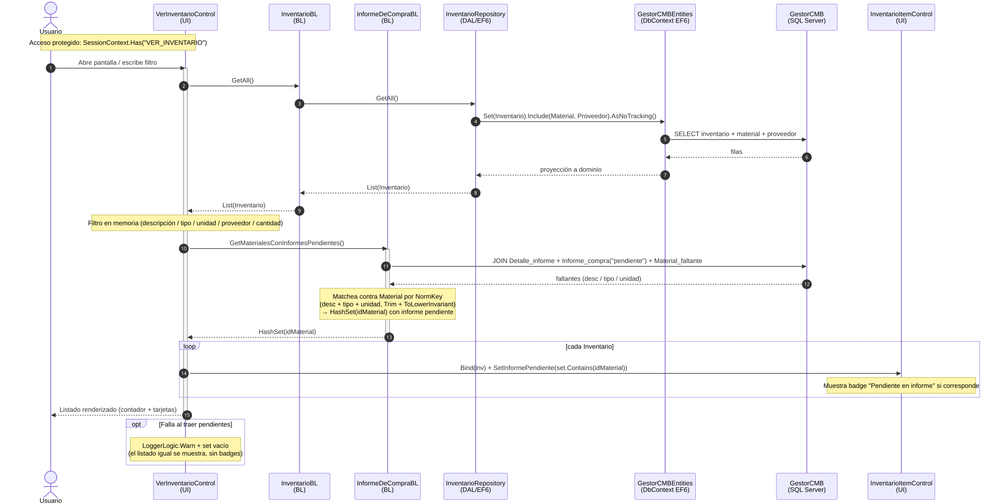

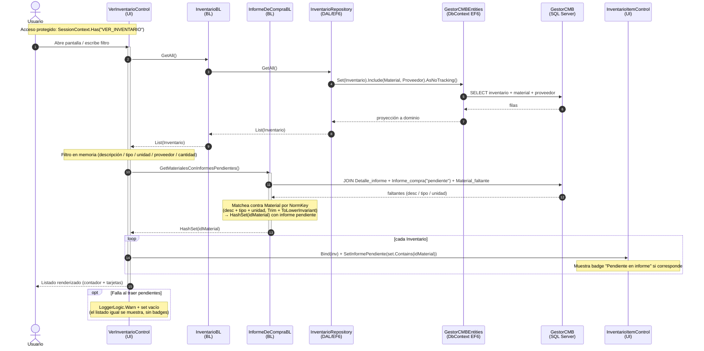
```mermaid
sequenceDiagram
    autonumber
    actor U as Usuario
    participant IC as VerInventarioControl<br/>(UI)
    participant IBL as InventarioBL<br/>(BL)
    participant IDBL as InformeDeCompraBL<br/>(BL)
    participant Repo as InventarioRepository<br/>(DAL/EF6)
    participant Ctx as GestorCMBEntities<br/>(DbContext EF6)
    participant DB as GestorCMB<br/>(SQL Server)
    participant Item as InventarioItemControl<br/>(UI)

    Note over U,IC: Acceso protegido: SessionContext.Has("VER_INVENTARIO")

    U->>IC: Abre pantalla / escribe filtro
    activate IC
    IC->>IBL: GetAll()
    IBL->>Repo: GetAll()
    Repo->>Ctx: Set(Inventario).Include(Material, Proveedor).AsNoTracking()
    Ctx->>DB: SELECT inventario + material + proveedor
    DB-->>Ctx: filas
    Ctx-->>Repo: proyección a dominio
    Repo-->>IBL: List(Inventario)
    IBL-->>IC: List(Inventario)
    Note over IC: Filtro en memoria (descripción / tipo / unidad / proveedor / cantidad)

    IC->>IDBL: GetMaterialesConInformesPendientes()
    activate IDBL
    IDBL->>DB: JOIN Detalle_informe + Informe_compra("pendiente") + Material_faltante
    DB-->>IDBL: faltantes (desc / tipo / unidad)
    Note over IDBL: Matchea contra Material por NormKey<br/>(desc + tipo + unidad, Trim + ToLowerInvariant)<br/>→ HashSet(idMaterial) con informe pendiente
    IDBL-->>IC: HashSet(idMaterial)
    deactivate IDBL

    loop cada Inventario
        IC->>Item: Bind(inv) + SetInformePendiente(set.Contains(idMaterial))
        Note over Item: Muestra badge "Pendiente en informe" si corresponde
    end
    IC-->>U: Listado renderizado (contador + tarjetas)
    deactivate IC

    opt Falla al traer pendientes
        Note over IC: LoggerLogic.Warn + set vacío<br/>(el listado igual se muestra, sin badges)
    end
```

## 5.6.2 Gestionar materiales (ABM)

**Diseño:** `MaterialBL` coordina **dos repos** (Material + Inventario) en una sola transacción: el alta crea Material + Inventario(0); la baja es **física** y respeta la FK (borra Inventario antes que Material).

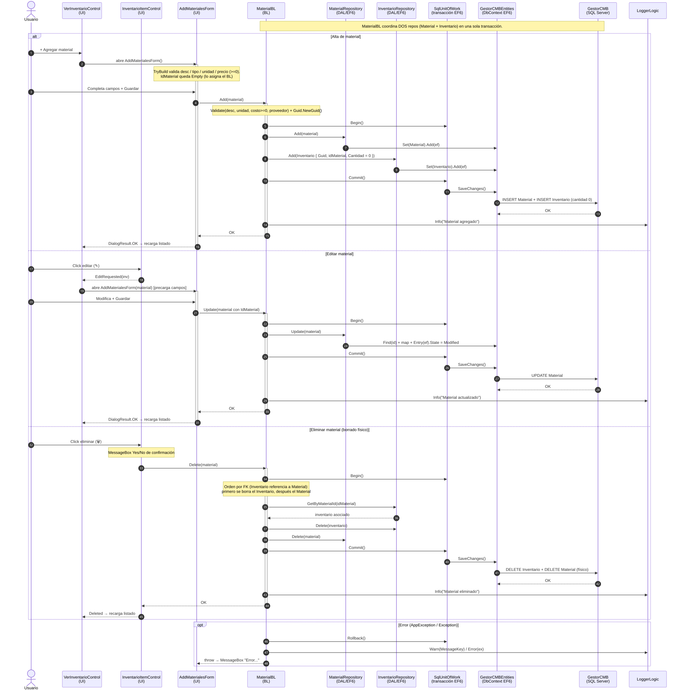

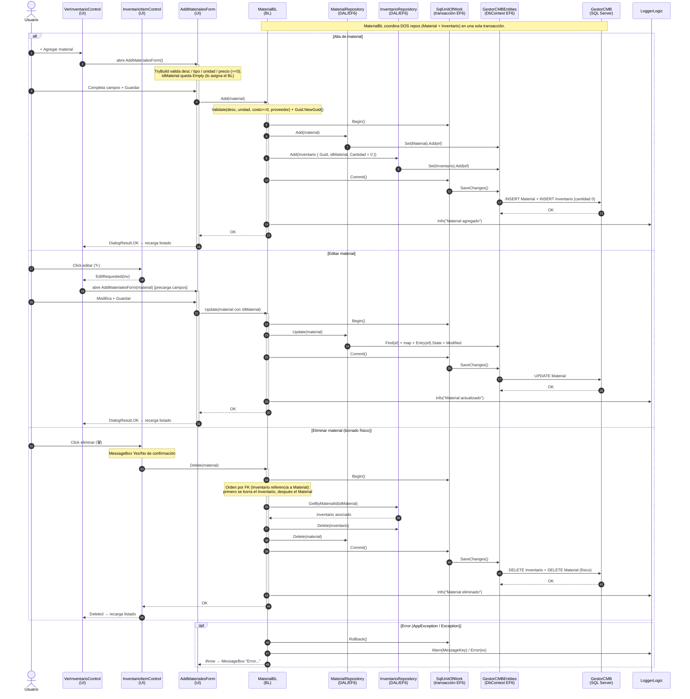
```mermaid
sequenceDiagram
    autonumber
    actor U as Usuario
    participant IC as VerInventarioControl<br/>(UI)
    participant Item as InventarioItemControl<br/>(UI)
    participant AMF as AddMaterialesForm<br/>(UI)
    participant MBL as MaterialBL<br/>(BL)
    participant MR as MaterialRepository<br/>(DAL/EF6)
    participant IR as InventarioRepository<br/>(DAL/EF6)
    participant UoW as SqlUnitOfWork<br/>(transacción EF6)
    participant Ctx as GestorCMBEntities<br/>(DbContext EF6)
    participant DB as GestorCMB<br/>(SQL Server)
    participant Log as LoggerLogic

    Note over MBL,DB: MaterialBL coordina DOS repos (Material + Inventario) en una sola transacción.

    alt Alta de material
        U->>IC: + Agregar material
        IC->>AMF: abre AddMaterialesForm()
        activate AMF
        Note over AMF: TryBuild valida desc / tipo / unidad / precio (>=0).<br/>IdMaterial queda Empty (lo asigna el BL)
        U->>AMF: Completa campos + Guardar
        AMF->>MBL: Add(material)
        activate MBL
        Note over MBL: Validate(desc, unidad, costo>=0, proveedor) + Guid.NewGuid()
        MBL->>UoW: Begin()
        MBL->>MR: Add(material)
        MR->>Ctx: Set(Material).Add(ef)
        MBL->>IR: Add(Inventario { Guid, idMaterial, Cantidad = 0 })
        IR->>Ctx: Set(Inventario).Add(ef)
        MBL->>UoW: Commit()
        UoW->>Ctx: SaveChanges()
        Ctx->>DB: INSERT Material + INSERT Inventario (cantidad 0)
        DB-->>Ctx: OK
        MBL->>Log: Info("Material agregado")
        MBL-->>AMF: OK
        deactivate MBL
        AMF-->>IC: DialogResult.OK → recarga listado
        deactivate AMF

    else Editar material
        U->>Item: Click editar (✎)
        Item-->>IC: EditRequested(inv)
        IC->>AMF: abre AddMaterialesForm(material) [precarga campos]
        activate AMF
        U->>AMF: Modifica + Guardar
        AMF->>MBL: Update(material con IdMaterial)
        activate MBL
        MBL->>UoW: Begin()
        MBL->>MR: Update(material)
        MR->>Ctx: Find(id) + map + Entry(ef).State = Modified
        MBL->>UoW: Commit()
        UoW->>Ctx: SaveChanges()
        Ctx->>DB: UPDATE Material
        DB-->>Ctx: OK
        MBL->>Log: Info("Material actualizado")
        MBL-->>AMF: OK
        deactivate MBL
        AMF-->>IC: DialogResult.OK → recarga listado
        deactivate AMF

    else Eliminar material (borrado físico)
        U->>Item: Click eliminar (🗑)
        Note over Item: MessageBox Yes/No de confirmación
        Item->>MBL: Delete(material)
        activate MBL
        MBL->>UoW: Begin()
        Note over MBL: Orden por FK (Inventario referencia a Material):<br/>primero se borra el Inventario, después el Material
        MBL->>IR: GetByMaterialId(idMaterial)
        IR-->>MBL: inventario asociado
        MBL->>IR: Delete(inventario)
        MBL->>MR: Delete(material)
        MBL->>UoW: Commit()
        UoW->>Ctx: SaveChanges()
        Ctx->>DB: DELETE Inventario + DELETE Material (físico)
        DB-->>Ctx: OK
        MBL->>Log: Info("Material eliminado")
        MBL-->>Item: OK
        deactivate MBL
        Item-->>IC: Deleted → recarga listado
    end

    opt Error (AppException / Exception)
        MBL->>UoW: Rollback()
        MBL->>Log: Warn(MessageKey) / Error(ex)
        MBL-->>AMF: throw → MessageBox "Error..."
    end
```

## 5.6.3 Gestionar stock

**Diseño:** `CambiarCantidad(id, ±1)` con **clamp a 0** (no permite stock negativo: ante un resultado negativo hace Rollback y devuelve la cantidad actual). Decisión explícita: el ajuste de stock **no se registra en bitácora**.

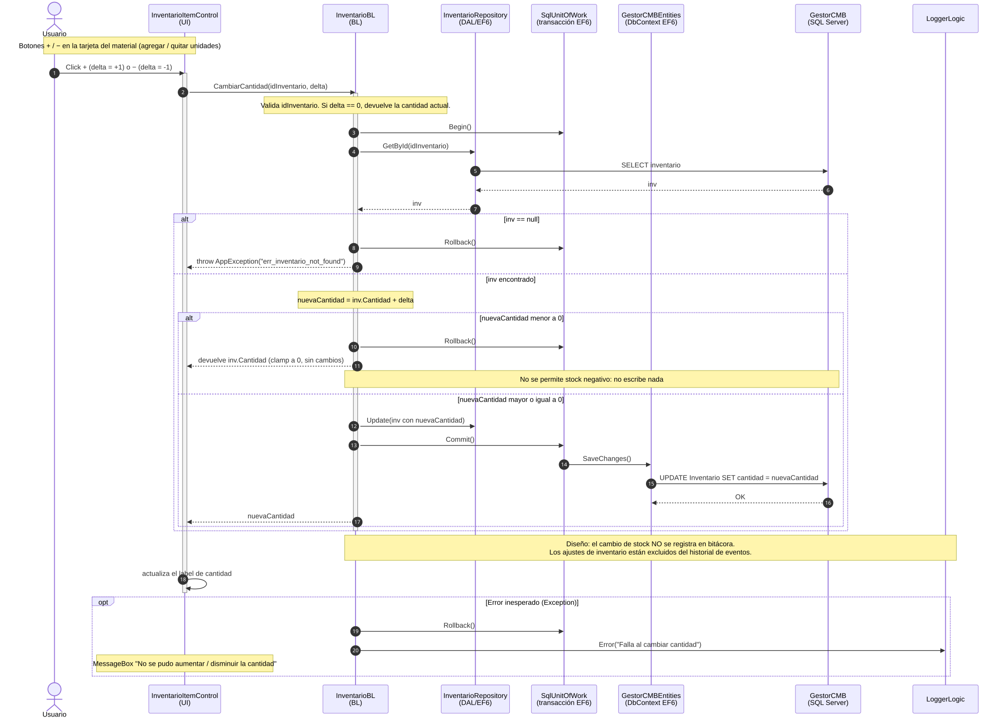

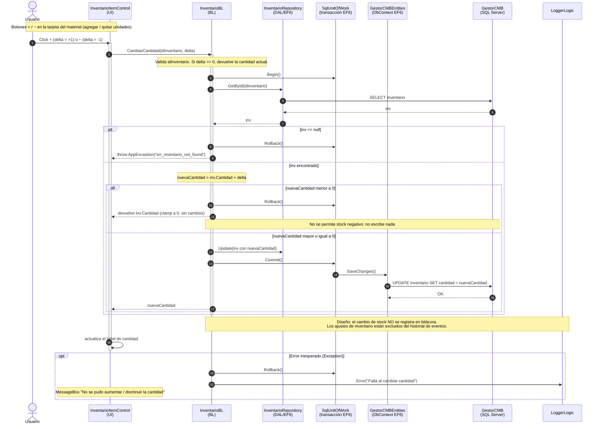
```mermaid
sequenceDiagram
    autonumber
    actor U as Usuario
    participant Item as InventarioItemControl<br/>(UI)
    participant IBL as InventarioBL<br/>(BL)
    participant Repo as InventarioRepository<br/>(DAL/EF6)
    participant UoW as SqlUnitOfWork<br/>(transacción EF6)
    participant Ctx as GestorCMBEntities<br/>(DbContext EF6)
    participant DB as GestorCMB<br/>(SQL Server)
    participant Log as LoggerLogic

    Note over U,Item: Botones + / − en la tarjeta del material (agregar / quitar unidades)

    U->>Item: Click + (delta = +1) o − (delta = -1)
    activate Item
    Item->>IBL: CambiarCantidad(idInventario, delta)
    activate IBL
    Note over IBL: Valida idInventario. Si delta == 0, devuelve la cantidad actual.
    IBL->>UoW: Begin()
    IBL->>Repo: GetById(idInventario)
    Repo->>DB: SELECT inventario
    DB-->>Repo: inv
    Repo-->>IBL: inv

    alt inv == null
        IBL->>UoW: Rollback()
        IBL-->>Item: throw AppException("err_inventario_not_found")
    else inv encontrado
        Note over IBL: nuevaCantidad = inv.Cantidad + delta
        alt nuevaCantidad menor a 0
            IBL->>UoW: Rollback()
            IBL-->>Item: devuelve inv.Cantidad (clamp a 0, sin cambios)
            Note over IBL,DB: No se permite stock negativo: no escribe nada
        else nuevaCantidad mayor o igual a 0
            IBL->>Repo: Update(inv con nuevaCantidad)
            IBL->>UoW: Commit()
            UoW->>Ctx: SaveChanges()
            Ctx->>DB: UPDATE Inventario SET cantidad = nuevaCantidad
            DB-->>Ctx: OK
            IBL-->>Item: nuevaCantidad
        end
    end
    deactivate IBL

    Note over IBL,Log: Diseño: el cambio de stock NO se registra en bitácora.<br/>Los ajustes de inventario están excluidos del historial de eventos.

    Item->>Item: actualiza el label de cantidad
    deactivate Item

    opt Error inesperado (Exception)
        IBL->>UoW: Rollback()
        IBL->>Log: Error("Falla al cambiar cantidad")
        Note over Item: MessageBox "No se pudo aumentar / disminuir la cantidad"
    end
```

---

# 5.7 Gestión de proveedores

**Diseño:** ABM EF6 con un único gate `GESTIONAR_PROVEEDORES`, alta **inline** en el sidebar. Como `Material` referencia a `Proveedor` (FK NOT NULL), la baja es **lógica** (`IsActive`), no física.

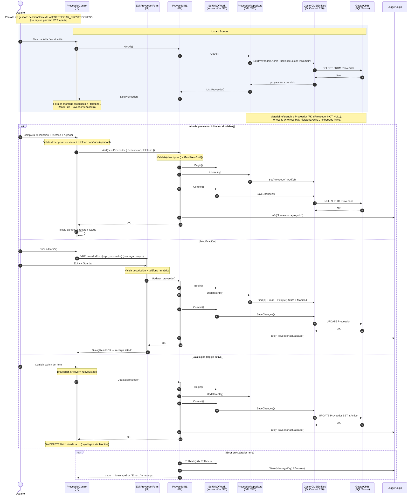

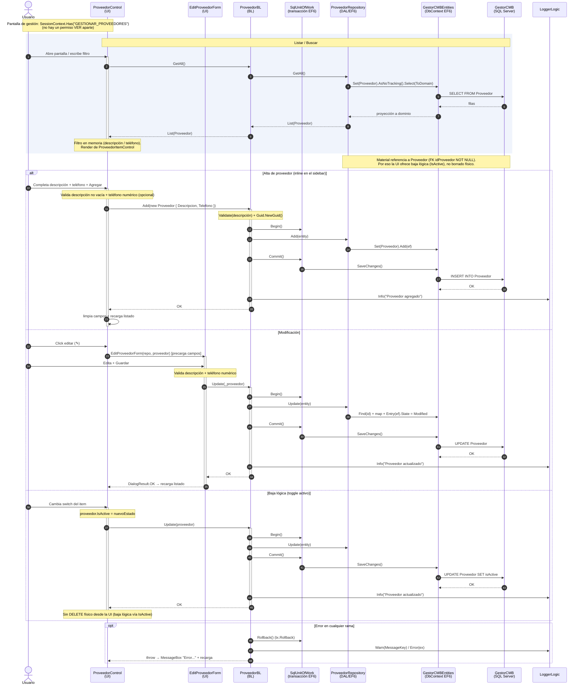
```mermaid
sequenceDiagram
    autonumber
    actor U as Usuario
    participant PC as ProveedorControl<br/>(UI)
    participant EPF as EditProveedorForm<br/>(UI)
    participant BL as ProveedorBL<br/>(BL)
    participant UoW as SqlUnitOfWork<br/>(transacción EF6)
    participant Repo as ProveedorRepository<br/>(DAL/EF6)
    participant Ctx as GestorCMBEntities<br/>(DbContext EF6)
    participant DB as GestorCMB<br/>(SQL Server)
    participant Log as LoggerLogic

    Note over U,PC: Pantalla de gestión: SessionContext.Has("GESTIONAR_PROVEEDORES")<br/>(no hay un permiso VER aparte)

    rect rgb(240, 244, 252)
        Note over PC,DB: Listar / Buscar
        U->>PC: Abre pantalla / escribe filtro
        activate PC
        PC->>BL: GetAll()
        BL->>Repo: GetAll()
        Repo->>Ctx: Set(Proveedor).AsNoTracking().Select(ToDomain)
        Ctx->>DB: SELECT FROM Proveedor
        DB-->>Ctx: filas
        Ctx-->>Repo: proyección a dominio
        Repo-->>BL: List(Proveedor)
        BL-->>PC: List(Proveedor)
        Note over PC: Filtro en memoria (descripción / teléfono).<br/>Render de ProveedorItemControl
        deactivate PC
    end

    Note over Repo,DB: Material referencia a Proveedor (FK idProveedor NOT NULL).<br/>Por eso la UI ofrece baja lógica (IsActive), no borrado físico.

    alt Alta de proveedor (inline en el sidebar)
        U->>PC: Completa descripción + teléfono + Agregar
        activate PC
        Note over PC: Valida descripción no vacía + teléfono numérico (opcional)
        PC->>BL: Add(new Proveedor { Descripcion, Telefono })
        activate BL
        Note over BL: Validate(descripción) + Guid.NewGuid()
        BL->>UoW: Begin()
        BL->>Repo: Add(entity)
        Repo->>Ctx: Set(Proveedor).Add(ef)
        BL->>UoW: Commit()
        UoW->>Ctx: SaveChanges()
        Ctx->>DB: INSERT INTO Proveedor
        DB-->>Ctx: OK
        BL->>Log: Info("Proveedor agregado")
        BL-->>PC: OK
        deactivate BL
        PC->>PC: limpia campos + recarga listado
        deactivate PC

    else Modificación
        U->>PC: Click editar (✎)
        PC->>EPF: EditProveedorForm(repo, proveedor) [precarga campos]
        activate EPF
        U->>EPF: Edita + Guardar
        Note over EPF: Valida descripción + teléfono numérico
        EPF->>BL: Update(_proveedor)
        activate BL
        BL->>UoW: Begin()
        BL->>Repo: Update(entity)
        Repo->>Ctx: Find(id) + map + Entry(ef).State = Modified
        BL->>UoW: Commit()
        UoW->>Ctx: SaveChanges()
        Ctx->>DB: UPDATE Proveedor
        DB-->>Ctx: OK
        BL->>Log: Info("Proveedor actualizado")
        BL-->>EPF: OK
        deactivate BL
        EPF-->>PC: DialogResult.OK → recarga listado
        deactivate EPF

    else Baja lógica (toggle activo)
        U->>PC: Cambia switch del item
        activate PC
        Note over PC: proveedor.IsActive = nuevoEstado
        PC->>BL: Update(proveedor)
        activate BL
        BL->>UoW: Begin()
        BL->>Repo: Update(entity)
        BL->>UoW: Commit()
        UoW->>Ctx: SaveChanges()
        Ctx->>DB: UPDATE Proveedor SET isActive
        DB-->>Ctx: OK
        BL->>Log: Info("Proveedor actualizado")
        BL-->>PC: OK
        deactivate BL
        Note over PC: Sin DELETE físico desde la UI (baja lógica vía IsActive)
        deactivate PC
    end

    opt Error en cualquier rama
        BL->>UoW: Rollback() (tx.Rollback)
        BL->>Log: Warn(MessageKey) / Error(ex)
        BL-->>PC: throw → MessageBox "Error..." + recarga
    end
```

---

# 5.8 Gestión de proyectos

## 5.8.1 Listar proyectos

**Diseño:** lista con numeración estable por `FechaInicio`, filtros por descripción y estado, y varios órdenes. El conteo de faltantes por proyecto es una consulta **N+1** (cada falla individual cuenta como 0).

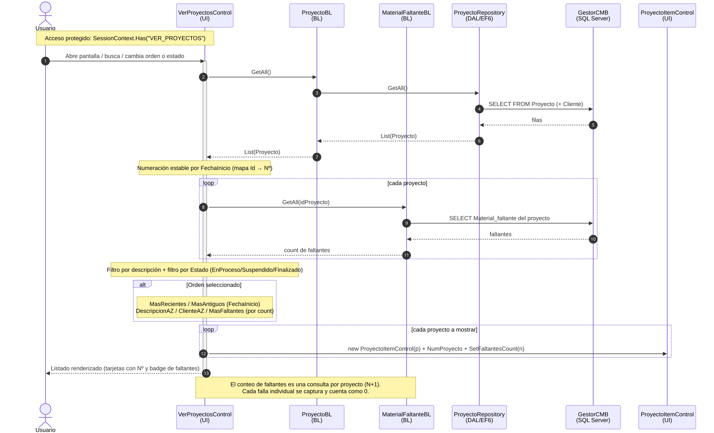

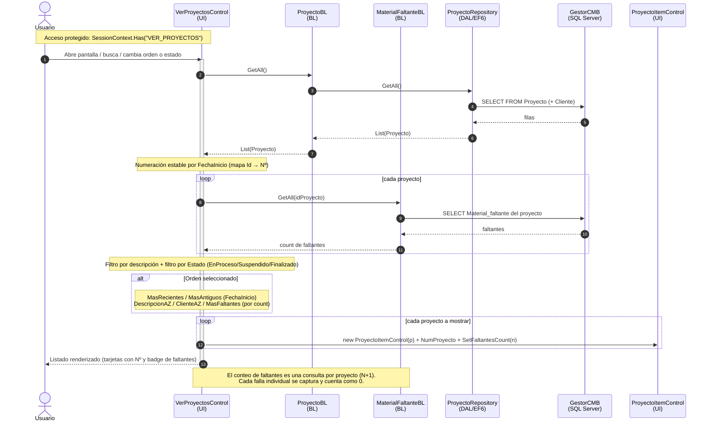
```mermaid
sequenceDiagram
    autonumber
    actor U as Usuario
    participant VC as VerProyectosControl<br/>(UI)
    participant PBL as ProyectoBL<br/>(BL)
    participant MFB as MaterialFaltanteBL<br/>(BL)
    participant Repo as ProyectoRepository<br/>(DAL/EF6)
    participant DB as GestorCMB<br/>(SQL Server)
    participant Item as ProyectoItemControl<br/>(UI)

    Note over U,VC: Acceso protegido: SessionContext.Has("VER_PROYECTOS")

    U->>VC: Abre pantalla / busca / cambia orden o estado
    activate VC
    VC->>PBL: GetAll()
    PBL->>Repo: GetAll()
    Repo->>DB: SELECT FROM Proyecto (+ Cliente)
    DB-->>Repo: filas
    Repo-->>PBL: List(Proyecto)
    PBL-->>VC: List(Proyecto)

    Note over VC: Numeración estable por FechaInicio (mapa Id → Nº)

    loop cada proyecto
        VC->>MFB: GetAll(idProyecto)
        MFB->>DB: SELECT Material_faltante del proyecto
        DB-->>MFB: faltantes
        MFB-->>VC: count de faltantes
    end
    Note over VC: Filtro por descripción + filtro por Estado (EnProceso/Suspendido/Finalizado)

    alt Orden seleccionado
        Note over VC: MasRecientes / MasAntiguos (FechaInicio)<br/>DescripcionAZ / ClienteAZ / MasFaltantes (por count)
    end

    loop cada proyecto a mostrar
        VC->>Item: new ProyectoItemControl(p) + NumProyecto + SetFaltantesCount(n)
    end
    VC-->>U: Listado renderizado (tarjetas con Nº y badge de faltantes)
    deactivate VC

    Note over VC,MFB: El conteo de faltantes es una consulta por proyecto (N+1).<br/>Cada falla individual se captura y cuenta como 0.
```

## 5.8.2 Cargar proyecto

**Diseño:** alta de proyecto. Carga el combo de clientes, valida campos, y crea el proyecto con `Estado = EnProceso` y `FechaFin = FechaInicio`.

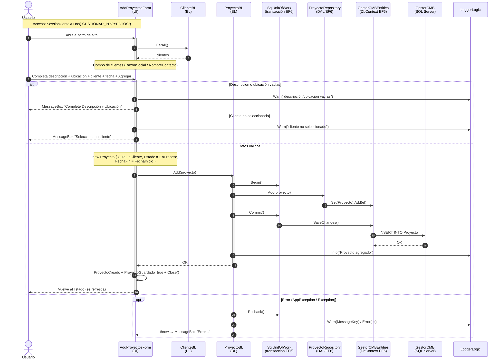

```mermaid
sequenceDiagram
    autonumber
    actor U as Usuario
    participant APF as AddProyectosForm<br/>(UI)
    participant CBL as ClienteBL<br/>(BL)
    participant PBL as ProyectoBL<br/>(BL)
    participant UoW as SqlUnitOfWork<br/>(transacción EF6)
    participant Repo as ProyectoRepository<br/>(DAL/EF6)
    participant Ctx as GestorCMBEntities<br/>(DbContext EF6)
    participant DB as GestorCMB<br/>(SQL Server)
    participant Log as LoggerLogic

    Note over U,APF: Acceso: SessionContext.Has("GESTIONAR_PROYECTOS")

    U->>APF: Abre el form de alta
    activate APF
    APF->>CBL: GetAll()
    CBL-->>APF: clientes
    Note over APF: Combo de clientes (RazonSocial / NombreContacto)
    deactivate APF

    U->>APF: Completa descripción + ubicación + cliente + fecha + Agregar
    activate APF
    alt Descripción o ubicación vacías
        APF->>Log: Warn("descripción/ubicación vacías")
        APF-->>U: MessageBox "Complete Descripción y Ubicación"
    else Cliente no seleccionado
        APF->>Log: Warn("cliente no seleccionado")
        APF-->>U: MessageBox "Seleccione un cliente"
    else Datos válidos
        Note over APF: new Proyecto { Guid, IdCliente, Estado = EnProceso,<br/>FechaFin = FechaInicio }
        APF->>PBL: Add(proyecto)
        activate PBL
        PBL->>UoW: Begin()
        PBL->>Repo: Add(proyecto)
        Repo->>Ctx: Set(Proyecto).Add(ef)
        PBL->>UoW: Commit()
        UoW->>Ctx: SaveChanges()
        Ctx->>DB: INSERT INTO Proyecto
        DB-->>Ctx: OK
        PBL->>Log: Info("Proyecto agregado")
        PBL-->>APF: OK
        deactivate PBL
        APF->>APF: ProyectoCreado + ProyectoGuardado=true + Close()
        APF-->>U: Vuelve al listado (se refresca)
    end
    deactivate APF

    opt Error (AppException / Exception)
        PBL->>UoW: Rollback()
        PBL->>Log: Warn(MessageKey) / Error(ex)
        PBL-->>APF: throw → MessageBox "Error..."
    end
```

## 5.8.3 Ver detalle de proyecto (materiales, faltantes, empleados y montos)

**Diseño:** la pantalla de detalle consolida cuatro lecturas — materiales asignados, faltantes, empleados asignados — y **recalcula montos** (`InformeMontoBL.Recalcular`), aplicando luego el margen de utilidad desde el `ParametrosContext` (Singleton).

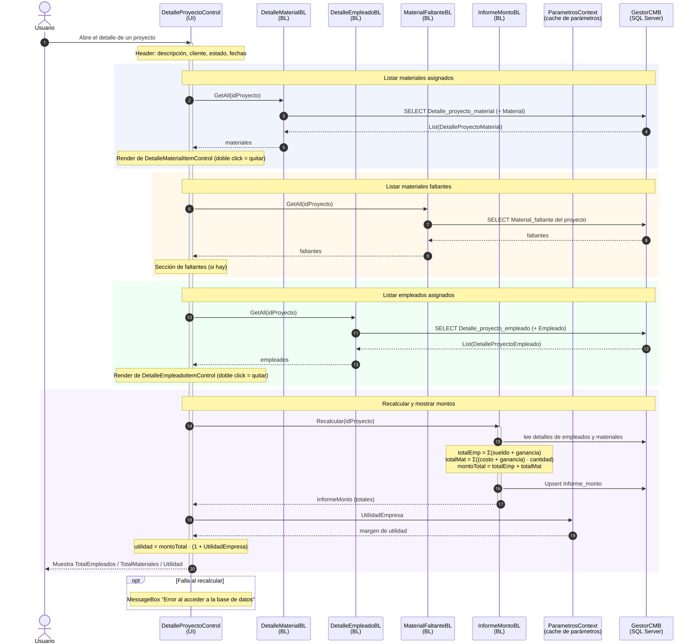

```mermaid
sequenceDiagram
    autonumber
    actor U as Usuario
    participant DPC as DetalleProyectoControl<br/>(UI)
    participant DMB as DetalleMaterialBL<br/>(BL)
    participant DEB as DetalleEmpleadoBL<br/>(BL)
    participant MFB as MaterialFaltanteBL<br/>(BL)
    participant IMB as InformeMontoBL<br/>(BL)
    participant Cfg as ParametrosContext<br/>(cache de parámetros)
    participant DB as GestorCMB<br/>(SQL Server)

    U->>DPC: Abre el detalle de un proyecto
    activate DPC
    Note over DPC: Header: descripción, cliente, estado, fechas

    rect rgb(240, 244, 252)
        Note over DPC,DB: Listar materiales asignados
        DPC->>DMB: GetAll(idProyecto)
        DMB->>DB: SELECT Detalle_proyecto_material (+ Material)
        DB-->>DMB: List(DetalleProyectoMaterial)
        DMB-->>DPC: materiales
        Note over DPC: Render de DetalleMaterialItemControl (doble click = quitar)
    end

    rect rgb(255, 248, 235)
        Note over DPC,DB: Listar materiales faltantes
        DPC->>MFB: GetAll(idProyecto)
        MFB->>DB: SELECT Material_faltante del proyecto
        DB-->>MFB: faltantes
        MFB-->>DPC: faltantes
        Note over DPC: Sección de faltantes (si hay)
    end

    rect rgb(240, 255, 244)
        Note over DPC,DB: Listar empleados asignados
        DPC->>DEB: GetAll(idProyecto)
        DEB->>DB: SELECT Detalle_proyecto_empleado (+ Empleado)
        DB-->>DEB: List(DetalleProyectoEmpleado)
        DEB-->>DPC: empleados
        Note over DPC: Render de DetalleEmpleadoItemControl (doble click = quitar)
    end

    rect rgb(248, 244, 255)
        Note over DPC,DB: Recalcular y mostrar montos
        DPC->>IMB: Recalcular(idProyecto)
        activate IMB
        IMB->>DB: lee detalles de empleados y materiales
        Note over IMB: totalEmp = Σ(sueldo + ganancia)<br/>totalMat = Σ((costo + ganancia) · cantidad)<br/>montoTotal = totalEmp + totalMat
        IMB->>DB: Upsert Informe_monto
        IMB-->>DPC: InformeMonto (totales)
        deactivate IMB
        DPC->>Cfg: UtilidadEmpresa
        Cfg-->>DPC: margen de utilidad
        Note over DPC: utilidad = montoTotal · (1 + UtilidadEmpresa)
        DPC-->>U: Muestra TotalEmpleados / TotalMateriales / Utilidad
    end
    deactivate DPC

    opt Falla al recalcular
        Note over DPC: MessageBox "Error al acceder a la base de datos"
    end
```

## 5.8.4 Asignar materiales

**Diseño:** al asignar desde inventario, `asignada = min(stock, solicitada)`: descuenta el stock y, si hay faltante, registra `Material_faltante` (que luego alimenta el informe de compra). Quitar el material **reintegra** el stock.

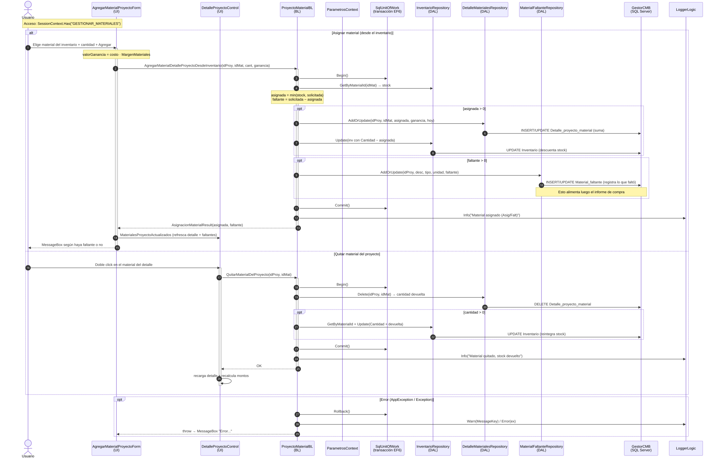

```mermaid
sequenceDiagram
    autonumber
    actor U as Usuario
    participant AMF as AgregarMaterialProyectoForm<br/>(UI)
    participant DPC as DetalleProyectoControl<br/>(UI)
    participant PMB as ProyectoMaterialBL<br/>(BL)
    participant Cfg as ParametrosContext
    participant UoW as SqlUnitOfWork<br/>(transacción EF6)
    participant Inv as InventarioRepository<br/>(DAL)
    participant Det as DetalleMaterialesRepository<br/>(DAL)
    participant Falt as MaterialFaltanteRepository<br/>(DAL)
    participant DB as GestorCMB<br/>(SQL Server)
    participant Log as LoggerLogic

    Note over U,AMF: Acceso: SessionContext.Has("GESTIONAR_MATERIALES")

    alt Asignar material (desde el inventario)
        U->>AMF: Elige material del inventario + cantidad + Agregar
        activate AMF
        Note over AMF: valorGanancia = costo · MargenMateriales
        AMF->>PMB: AgregarMaterialDetalleProyectoDesdeInventario(idProy, idMat, cant, ganancia)
        activate PMB
        PMB->>UoW: Begin()
        PMB->>Inv: GetByMaterialId(idMat) → stock
        Note over PMB: asignada = min(stock, solicitada)<br/>faltante = solicitada − asignada
        opt asignada > 0
            PMB->>Det: AddOrUpdate(idProy, idMat, asignada, ganancia, hoy)
            Det->>DB: INSERT/UPDATE Detalle_proyecto_material (suma)
            PMB->>Inv: Update(inv con Cantidad − asignada)
            Inv->>DB: UPDATE Inventario (descuenta stock)
        end
        opt faltante > 0
            PMB->>Falt: AddOrUpdate(idProy, desc, tipo, unidad, faltante)
            Falt->>DB: INSERT/UPDATE Material_faltante (registra lo que faltó)
            Note over Falt,DB: Esto alimenta luego el informe de compra
        end
        PMB->>UoW: Commit()
        PMB->>Log: Info("Material asignado (Asig/Falt)")
        PMB-->>AMF: AsignacionMaterialResult(asignada, faltante)
        deactivate PMB
        AMF->>DPC: MaterialesProyectoActualizados (refresca detalle + faltantes)
        AMF-->>U: MessageBox según haya faltante o no
        deactivate AMF

    else Quitar material del proyecto
        U->>DPC: Doble click en el material del detalle
        activate DPC
        DPC->>PMB: QuitarMaterialDelProyecto(idProy, idMat)
        activate PMB
        PMB->>UoW: Begin()
        PMB->>Det: Delete(idProy, idMat) → cantidad devuelta
        Det->>DB: DELETE Detalle_proyecto_material
        opt cantidad > 0
            PMB->>Inv: GetByMaterialId + Update(Cantidad + devuelta)
            Inv->>DB: UPDATE Inventario (reintegra stock)
        end
        PMB->>UoW: Commit()
        PMB->>Log: Info("Material quitado, stock devuelto")
        PMB-->>DPC: OK
        deactivate PMB
        DPC->>DPC: recarga detalle + recalcula montos
        deactivate DPC
    end

    opt Error (AppException / Exception)
        PMB->>UoW: Rollback()
        PMB->>Log: Warn(MessageKey) / Error(ex)
        PMB-->>AMF: throw → MessageBox "Error..."
    end
```

## 5.8.5 Asignar empleados y calcular montos

**Diseño:** asignar un empleado valida que no esté ya en el proyecto, que esté activo y que no supere `MAX_PROYECTOS_ACTIVOS = 3`. El cálculo de montos (`InformeMontoBL.Recalcular`) suma empleados y materiales con su ganancia; la utilidad aplica el margen del `ParametrosContext`. El recálculo **no se loguea** (no es evento de negocio).

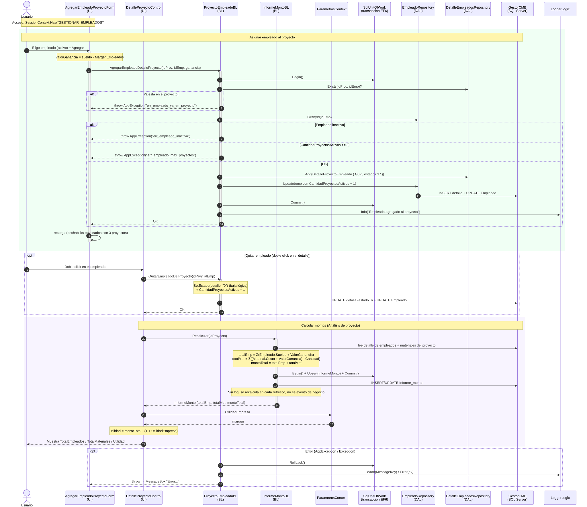

```mermaid
sequenceDiagram
    autonumber
    actor U as Usuario
    participant AEF as AgregarEmpleadoProyectoForm<br/>(UI)
    participant DPC as DetalleProyectoControl<br/>(UI)
    participant PEB as ProyectoEmpleadoBL<br/>(BL)
    participant IMB as InformeMontoBL<br/>(BL)
    participant Cfg as ParametrosContext
    participant UoW as SqlUnitOfWork<br/>(transacción EF6)
    participant EmpR as EmpleadoRepository<br/>(DAL)
    participant DetR as DetalleEmpleadosRepository<br/>(DAL)
    participant DB as GestorCMB<br/>(SQL Server)
    participant Log as LoggerLogic

    Note over U,AEF: Acceso: SessionContext.Has("GESTIONAR_EMPLEADOS")

    rect rgb(240, 255, 244)
        Note over U,DB: Asignar empleado al proyecto
        U->>AEF: Elige empleado (activo) + Agregar
        activate AEF
        Note over AEF: valorGanancia = sueldo · MargenEmpleados
        AEF->>PEB: AgregarEmpleadoDetalleProyecto(idProy, idEmp, ganancia)
        activate PEB
        PEB->>UoW: Begin()
        PEB->>DetR: Exists(idProy, idEmp)?
        alt Ya está en el proyecto
            PEB-->>AEF: throw AppException("err_empleado_ya_en_proyecto")
        end
        PEB->>EmpR: GetById(idEmp)
        alt Empleado inactivo
            PEB-->>AEF: throw AppException("err_empleado_inactivo")
        else CantidadProyectosActivos >= 3
            PEB-->>AEF: throw AppException("err_empleado_max_proyectos")
        else OK
            PEB->>DetR: Add(DetalleProyectoEmpleado { Guid, estado="1" })
            PEB->>EmpR: Update(emp con CantidadProyectosActivos + 1)
            EmpR->>DB: INSERT detalle + UPDATE Empleado
            PEB->>UoW: Commit()
            PEB->>Log: Info("Empleado agregado al proyecto")
            PEB-->>AEF: OK
        end
        deactivate PEB
        AEF->>AEF: recarga (deshabilita empleados con 3 proyectos)
        deactivate AEF
    end

    opt Quitar empleado (doble click en el detalle)
        U->>DPC: Doble click en el empleado
        DPC->>PEB: QuitarEmpleadoDelProyecto(idProy, idEmp)
        activate PEB
        Note over PEB: SetEstado(detalle, "0") (baja lógica)<br/>+ CantidadProyectosActivos − 1
        PEB->>DB: UPDATE detalle (estado 0) + UPDATE Empleado
        PEB-->>DPC: OK
        deactivate PEB
    end

    rect rgb(248, 244, 255)
        Note over DPC,DB: Calcular montos (Análisis de proyecto)
        DPC->>IMB: Recalcular(idProyecto)
        activate IMB
        IMB->>DB: lee detalle de empleados + materiales del proyecto
        Note over IMB: totalEmp = Σ(Empleado.Sueldo + ValorGanancia)<br/>totalMat = Σ((Material.Costo + ValorGanancia) · Cantidad)<br/>montoTotal = totalEmp + totalMat
        IMB->>UoW: Begin() + Upsert(InformeMonto) + Commit()
        IMB->>DB: INSERT/UPDATE Informe_monto
        Note over IMB: Sin log: se recalcula en cada refresco, no es evento de negocio
        IMB-->>DPC: InformeMonto (totalEmp, totalMat, montoTotal)
        deactivate IMB
        DPC->>Cfg: UtilidadEmpresa
        Cfg-->>DPC: margen
        Note over DPC: utilidad = montoTotal · (1 + UtilidadEmpresa)
        DPC-->>U: Muestra TotalEmpleados / TotalMateriales / Utilidad
    end

    opt Error (AppException / Exception)
        PEB->>UoW: Rollback()
        PEB->>Log: Warn(MessageKey) / Error(ex)
        PEB-->>AEF: throw → MessageBox "Error..."
    end
```

---

# 5.9 Configuración de parámetros del sistema

**Diseño:** parámetros de negocio (márgenes y utilidad) en `GestorCMB_Users` vía **ADO.NET**. El servicio hace **autobootstrap** (`EnsureTableAndSeed`), registra **auditoría** (`UltimaModificacion` + `ModificadoPor` desde `SessionContext`) y, al guardar, refresca el **cache Singleton** `ParametrosContext` para que los nuevos márgenes apliquen al instante (sin reiniciar). Estos valores alimentan el cálculo de montos del proyecto (5.8.5).

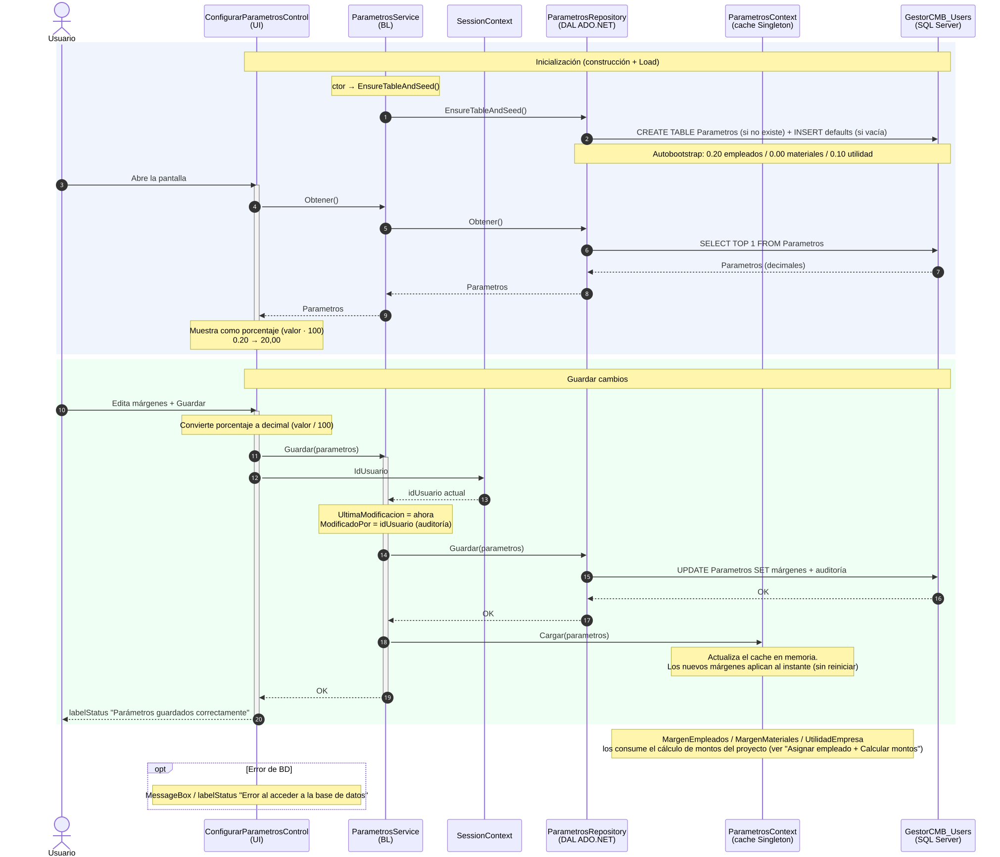

```mermaid
sequenceDiagram
    autonumber
    actor U as Usuario
    participant CPC as ConfigurarParametrosControl<br/>(UI)
    participant PS as ParametrosService<br/>(BL)
    participant Sess as SessionContext
    participant Repo as ParametrosRepository<br/>(DAL ADO.NET)
    participant Cache as ParametrosContext<br/>(cache Singleton)
    participant DB as GestorCMB_Users<br/>(SQL Server)

    rect rgb(240, 244, 252)
        Note over CPC,DB: Inicialización (construcción + Load)
        Note over PS: ctor → EnsureTableAndSeed()
        PS->>Repo: EnsureTableAndSeed()
        Repo->>DB: CREATE TABLE Parametros (si no existe) + INSERT defaults (si vacía)
        Note over Repo,DB: Autobootstrap: 0.20 empleados / 0.00 materiales / 0.10 utilidad
        U->>CPC: Abre la pantalla
        activate CPC
        CPC->>PS: Obtener()
        PS->>Repo: Obtener()
        Repo->>DB: SELECT TOP 1 FROM Parametros
        DB-->>Repo: Parametros (decimales)
        Repo-->>PS: Parametros
        PS-->>CPC: Parametros
        Note over CPC: Muestra como porcentaje (valor · 100)<br/>0.20 → 20,00
        deactivate CPC
    end

    rect rgb(240, 255, 244)
        Note over CPC,DB: Guardar cambios
        U->>CPC: Edita márgenes + Guardar
        activate CPC
        Note over CPC: Convierte porcentaje a decimal (valor / 100)
        CPC->>PS: Guardar(parametros)
        activate PS
        CPC->>Sess: IdUsuario
        Sess-->>PS: idUsuario actual
        Note over PS: UltimaModificacion = ahora<br/>ModificadoPor = idUsuario (auditoría)
        PS->>Repo: Guardar(parametros)
        Repo->>DB: UPDATE Parametros SET márgenes + auditoría
        DB-->>Repo: OK
        Repo-->>PS: OK
        PS->>Cache: Cargar(parametros)
        Note over Cache: Actualiza el cache en memoria.<br/>Los nuevos márgenes aplican al instante (sin reiniciar)
        PS-->>CPC: OK
        deactivate PS
        CPC-->>U: labelStatus "Parámetros guardados correctamente"
        deactivate CPC
    end

    Note over Cache: MargenEmpleados / MargenMateriales / UtilidadEmpresa<br/>los consume el cálculo de montos del proyecto (ver 5.8.5)

    opt Error de BD
        Note over CPC: MessageBox / labelStatus "Error al acceder a la base de datos"
    end
```

---

# 5.10 Auditoría: grabar bitácora

**Diseño:** transversal a todo el sistema. `LoggerLogic` (fachada estática) resuelve la estrategia **una sola vez** (`Lazy`) vía `LoggerFactory` según `AppSettings["LoggerType"]`. Con `"both"` agrupa archivo + base de datos en un **Composite** que itera sus destinos con **aislamiento de fallas** (try/catch por destino: si uno falla, el resto sigue) — patrón **Strategy + Composite**.

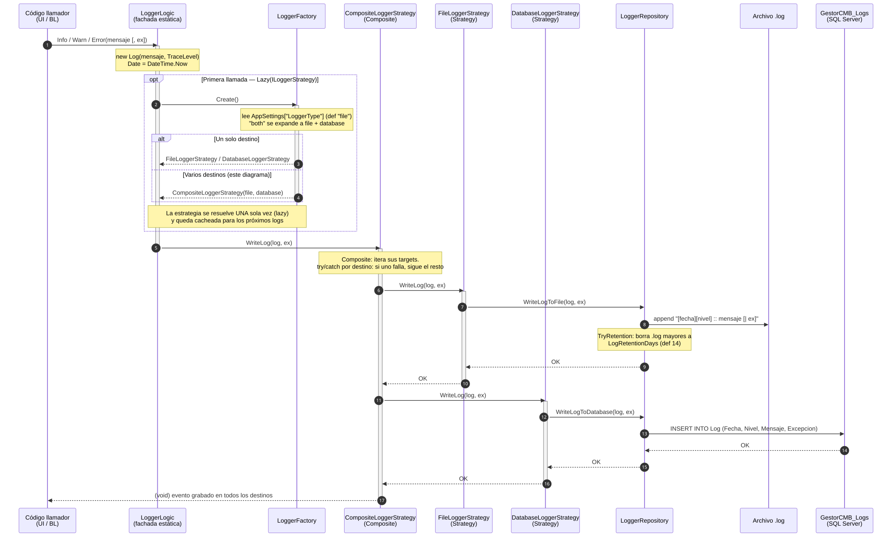

```mermaid
sequenceDiagram
    autonumber
    participant C as Código llamador<br/>(UI / BL)
    participant LL as LoggerLogic<br/>(fachada estática)
    participant LF as LoggerFactory
    participant CS as CompositeLoggerStrategy<br/>(Composite)
    participant FS as FileLoggerStrategy<br/>(Strategy)
    participant DS as DatabaseLoggerStrategy<br/>(Strategy)
    participant LR as LoggerRepository
    participant Arch as Archivo .log
    participant DB as GestorCMB_Logs<br/>(SQL Server)

    C->>LL: Info / Warn / Error(mensaje [, ex])
    activate LL
    Note over LL: new Log(mensaje, TraceLevel)<br/>Date = DateTime.Now

    opt Primera llamada — Lazy(ILoggerStrategy)
        LL->>LF: Create()
        activate LF
        Note over LF: lee AppSettings["LoggerType"] (def "file")<br/>"both" se expande a file + database
        alt Un solo destino
            LF-->>LL: FileLoggerStrategy / DatabaseLoggerStrategy
        else Varios destinos (este diagrama)
            LF-->>LL: CompositeLoggerStrategy(file, database)
        end
        deactivate LF
        Note over LL,LF: La estrategia se resuelve UNA sola vez (lazy)<br/>y queda cacheada para los próximos logs
    end

    LL->>CS: WriteLog(log, ex)
    deactivate LL
    activate CS
    Note over CS: Composite: itera sus targets.<br/>try/catch por destino: si uno falla, sigue el resto

    CS->>FS: WriteLog(log, ex)
    activate FS
    FS->>LR: WriteLogToFile(log, ex)
    LR->>Arch: append "[fecha][nivel] :: mensaje [| ex]"
    Note over LR: TryRetention: borra .log mayores a<br/>LogRetentionDays (def 14)
    LR-->>FS: OK
    FS-->>CS: OK
    deactivate FS

    CS->>DS: WriteLog(log, ex)
    activate DS
    DS->>LR: WriteLogToDatabase(log, ex)
    LR->>DB: INSERT INTO Log (Fecha, Nivel, Mensaje, Excepcion)
    DB-->>LR: OK
    LR-->>DS: OK
    DS-->>CS: OK
    deactivate DS

    CS-->>C: (void) evento grabado en todos los destinos
    deactivate CS
```
