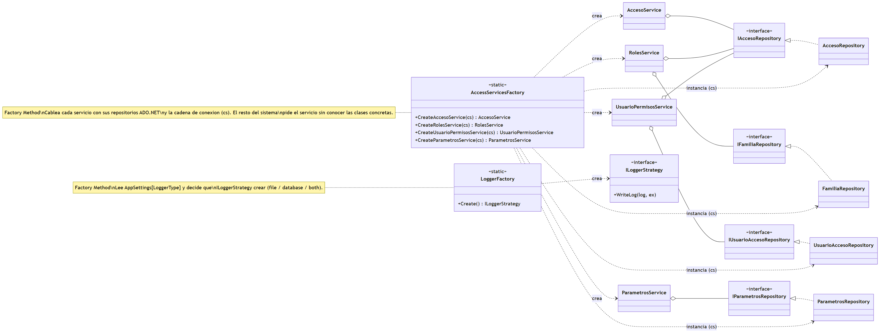

# Patrones de diseño aplicados

> Esta sección documenta los patrones de diseño implementados en **Gestor CMB**. Para cada uno se indica el problema que resuelve, cómo se aplicó en el sistema, las clases participantes con su rol, dónde se ve en el código y qué diagrama de secuencia lo ilustra.
>
> Los patrones presentes son: **Composite**, **Strategy**, **Facade**, **Repository + Unit of Work**, **Factory Method** y **Singleton**.

## Resumen

| Patrón | Categoría (GoF) | Dónde se aplica | Diagrama de secuencia relacionado |
|---|---|---|---|
| Composite | Estructural | Control de acceso (RBAC): roles y permisos | Asignar rol a usuario / Gestionar permisos de un rol |
| Strategy | De comportamiento | Destinos de la bitácora (archivo / base de datos) | Grabar bitácora |
| Composite | Estructural | Agrupar varios destinos de log en uno | Grabar bitácora |
| Facade | Estructural | `LoggerLogic` como punto de entrada del logging | Grabar bitácora (transversal) |
| Repository + Unit of Work | — / arquitectónicos | Acceso a datos de negocio con EF6 y transacciones | Gestión de clientes / empleados / proveedores / proyectos |
| Factory Method | De creación | Construcción de estrategias de log y de servicios de acceso | Grabar bitácora / Login |
| Singleton | De creación | i18n (`LanguageService`) y cache de parámetros (`ParametrosContext`) | Cambiar idioma / Configurar parámetros |

---

## 1. Composite — Modelo de control de acceso (RBAC)

**Problema.** El sistema necesita evaluar si un usuario tiene un permiso determinado, sin importar si ese permiso lo tiene asignado directamente (permiso suelto) o lo hereda de un rol que agrupa muchos permisos. Se quiere tratar **de forma uniforme** a un permiso individual y a un conjunto de permisos.

**Solución en Gestor CMB.** Se modela la autorización como un árbol donde tanto las hojas (permisos individuales) como los nodos compuestos (roles) implementan la misma interfaz `IPermiso`. Preguntar `TienePermiso(...)` funciona igual sobre una hoja que sobre un rol: el rol simplemente delega la pregunta a sus hijos.

**Clases participantes.**

| Rol en el patrón | Clase | Responsabilidad |
|---|---|---|
| Componente | `IPermiso` | Declara `TienePermiso(TipoPermiso)`, `Nombre`, `Id` |
| Hoja (Leaf) | `Acceso` | Permiso atómico. `TienePermiso(p)` devuelve `DataKey == p` |
| Compuesto (Composite) | `RolCompuesto` | Mantiene una lista de hijos `IPermiso`; `TienePermiso(p)` recorre los hijos hasta encontrar uno que lo tenga |

**Código (resumido).**

```csharp
// Componente
public interface IPermiso
{
    bool TienePermiso(TipoPermiso permiso);
    string Nombre { get; }
    Guid Id { get; }
}

// Hoja
public class Acceso : IPermiso
{
    public TipoPermiso DataKey { get; private set; }
    public bool TienePermiso(TipoPermiso permiso) => DataKey == permiso;
}

// Compuesto
public class RolCompuesto : IPermiso
{
    private readonly List<IPermiso> _hijos = new List<IPermiso>();
    public void AgregarHijo(IPermiso componente) => _hijos.Add(componente);
    public void QuitarHijo(IPermiso componente) => _hijos.Remove(componente);

    public bool TienePermiso(TipoPermiso permiso)
    {
        foreach (var hijo in _hijos)
            if (hijo.TienePermiso(permiso)) return true;
        return false;
    }
}
```

**Persistencia.** El árbol se materializa en la base `GestorCMB_Users` mediante las tablas `Familia` (rol), `Acceso` (permiso/hoja), `Familia_Acceso` (qué accesos tiene cada rol) y `Usuario_Familia` (qué roles tiene cada usuario). La clave funcional de cada `Acceso` es su `dataKey` (`TipoPermiso`), que es lo que evalúa `SessionContext.Has(...)` al autorizar una acción en la UI.

**Beneficio.** Agregar un permiso a un rol, crear un rol nuevo o quitarle un permiso no cambia la forma en que el resto del sistema consulta la autorización: siempre es `TienePermiso(...)`. La jerarquía es extensible sin tocar el código que la consume.

**Diagrama de clases:**



**Diagramas de secuencia relacionados:** *Asignar rol a usuario* y *Gestionar permisos de un rol* (sección 5.2).

---

## 2. Strategy + Composite + Facade — Bitácora (logging)

Este módulo combina tres patrones que trabajan juntos.

### 2.1 Strategy — destino de la bitácora

**Problema.** Un evento de log debe poder escribirse en distintos destinos (un archivo `.log`, una base de datos, o ambos) y esa decisión debe ser configurable sin reescribir el código que loguea.

**Solución.** Cada destino es una **estrategia** intercambiable que implementa `ILoggerStrategy`. El código que loguea no conoce el destino concreto.

| Rol en el patrón | Clase | Responsabilidad |
|---|---|---|
| Estrategia | `ILoggerStrategy` | Declara `WriteLog(Log log, Exception ex)` |
| Estrategia concreta | `FileLoggerStrategy` | Escribe el evento en un archivo `.log` (con política de retención) |
| Estrategia concreta | `DatabaseLoggerStrategy` | Inserta el evento en la base `GestorCMB_Logs` |

### 2.2 Composite — agrupar varios destinos

**Problema.** Cuando se configura "ambos" destinos, hay que escribir en archivo **y** en base de datos, y que la falla de uno **no impida** al otro.

**Solución.** `CompositeLoggerStrategy` es a la vez una `ILoggerStrategy` y un contenedor de estrategias: recorre sus destinos y escribe en todos, **aislando las fallas** con un try/catch por destino.

```csharp
public sealed class CompositeLoggerStrategy : ILoggerStrategy
{
    private readonly IList<ILoggerStrategy> _targets;
    public CompositeLoggerStrategy(params ILoggerStrategy[] targets) { _targets = targets ?? ...; }

    public void WriteLog(Log log, Exception ex)
    {
        foreach (var t in _targets)
        {
            try { t.WriteLog(log, ex); }
            catch { /* no romper a los demás destinos */ }
        }
    }
}
```

> Nota: el Composite acá aplica la misma idea que en el RBAC — tratar "un destino" y "un grupo de destinos" de manera uniforme bajo la misma interfaz `ILoggerStrategy`.

### 2.3 Facade — punto de entrada único

**Problema.** No se quiere que cada clase de UI o de negocio tenga que construir la estrategia, leer la configuración, etc., solo para escribir una línea de log.

**Solución.** `LoggerLogic` es una **fachada estática** con métodos simples (`Info`, `Warn`, `Error`, `Debug`, `Critical`). Resuelve la estrategia **una sola vez** de forma diferida (`Lazy<ILoggerStrategy>`) y oculta todo el detalle.

```csharp
public static class LoggerLogic
{
    private static readonly Lazy<ILoggerStrategy> _strategy =
        new Lazy<ILoggerStrategy>(() => LoggerFactory.Create());

    public static void Info(string message)  => Write(message, TraceLevel.Info, null);
    public static void Warn(string message)  => Write(message, TraceLevel.Warning, null);
    public static void Error(string message, Exception ex) => Write(message, TraceLevel.Error, ex);

    private static void Write(string message, TraceLevel level, Exception ex)
        => _strategy.Value.WriteLog(new Log(message, level), ex);
}
```

**Beneficio del conjunto.** Cambiar el destino del log es cambiar una línea de configuración (`LoggerType`), no código. Agregar un nuevo destino (por ejemplo, un servicio remoto) es crear una nueva `ILoggerStrategy` sin tocar a quienes loguean.

**Diagrama de clases:**



**Diagrama de secuencia relacionado:** *Grabar bitácora* (sección 5.10), donde se ve la fachada resolviendo la estrategia y el Composite escribiendo en archivo + base de datos.

---

## 3. Factory Method — Construcción de objetos

**Problema.** La decisión de **qué** estrategia de log instanciar (o cómo cablear un servicio de acceso con sus repositorios y la cadena de conexión) no debe estar dispersa por el sistema.

**Solución.** Se centraliza la construcción en fábricas dedicadas.

**3.1 `LoggerFactory`** — lee `AppSettings["LoggerType"]` y decide qué `ILoggerStrategy` crear: una sola estrategia (`file` o `database`) o, si el valor es `both` (o una lista), las agrupa en un `CompositeLoggerStrategy`.

```csharp
public static class LoggerFactory
{
    public static ILoggerStrategy Create()
    {
        var raw = (ConfigurationManager.AppSettings["LoggerType"] ?? "file").Trim();
        // "both" → file + database; un token → estrategia simple; varios → Composite
        ...
        return new CompositeLoggerStrategy(list);
    }
}
```

**3.2 `AccessServicesFactory`** — construye los servicios de seguridad (`AccesoService`, `RolesService`, `UsuarioPermisosService`, `ParametrosService`) inyectándoles sus repositorios ADO.NET ya cableados con la cadena de conexión.

```csharp
public static RolesService CreateRolesService(string cs)
{
    IFamiliaRepository famRepo = new FamiliaRepository(cs);
    IAccesoRepository  accRepo = new AccesoRepository(cs);
    return new RolesService(famRepo, accRepo);
}
```

**Beneficio.** El resto del sistema pide "dame el logger" o "dame el servicio de roles" sin conocer las clases concretas ni el cableado. Cambiar una implementación se hace en un solo lugar.

**Diagrama de clases:**



---

## 4. Repository + Unit of Work — Acceso a datos de negocio (EF6)

**Problema.** Las operaciones de negocio (alta de cliente, asignación de material, etc.) tocan varias tablas y deben ser **atómicas**: o se aplican todas, o ninguna. Además se quiere aislar la lógica de negocio de los detalles de Entity Framework.

**Solución.**
- **Repository:** cada repositorio (`ClienteRepository`, `EmpleadoRepository`, `InventarioRepository`, etc.) encapsula las consultas y el mapeo entre la entidad de EF (`DAL.*`) y la entidad de dominio (`DomainModel.*`). Las lecturas usan `AsNoTracking`. **Importante: los repositorios NO llaman `SaveChanges`.**
- **Unit of Work:** `SqlUnitOfWork` agrupa todas las operaciones de una transacción. `Begin()` abre la transacción, `Commit()` ejecuta `SaveChanges()` y confirma, `Rollback()` revierte.

| Rol en el patrón | Clase / interfaz | Responsabilidad |
|---|---|---|
| Unit of Work | `IUnitOfWork` / `SqlUnitOfWork` | Maneja `Context`, `Begin` / `Commit` / `Rollback` |
| Repositorio | `ClienteRepository`, `EmpleadoRepository`, … | Consultas + mapeo entidad↔dominio sobre el `DbContext` |
| Contexto | `GestorCMBEntities` | `DbContext` de EF6 (Database-First / EDMX) |

```csharp
public sealed class SqlUnitOfWork : IUnitOfWork, IDisposable
{
    public GestorCMBEntities Context { get; }
    private DbContextTransaction _tx;

    public void Begin()    { if (_tx != null) return; _tx = Context.Database.BeginTransaction(); }
    public void Commit()   { Context.SaveChanges(); _tx?.Commit(); _tx?.Dispose(); _tx = null; }
    public void Rollback() { _tx?.Rollback(); _tx?.Dispose(); _tx = null; }
}
```

**Patrón de uso en la capa BL (molde repetido en todo el negocio):**

```csharp
using (var ctx = new GestorCMBEntities())
using (var uow = new SqlUnitOfWork(ctx))
{
    uow.Begin();
    try
    {
        repo.Add(entidad);     // el repo NO persiste
        uow.Commit();          // acá recién: SaveChanges + tx.Commit
    }
    catch { uow.Rollback(); throw; }
}
```

**Beneficio.** La transaccionalidad es explícita y consistente; la lógica de negocio no depende de la API de EF; y como el `Commit` es el único punto que persiste, es imposible dejar la base a medias dentro de una operación.

**Diagrama de clases** (ejemplo con `Cliente`; el mismo molde se repite para `Empleado`, `Proveedor`, `Proyecto`, etc.):



**Diagramas de secuencia relacionados:** *Gestión de clientes*, *Gestión de empleados*, *Gestión de proveedores* y todo el módulo de *Proyectos* (secciones 5.3, 5.4, 5.7 y 5.8).

---

## 5. Singleton — Estado global controlado

Se usa el patrón Singleton en dos puntos donde se necesita un único estado compartido durante toda la sesión.

**5.1 `LanguageService` (internacionalización).** Existe una sola instancia accesible vía `LanguageService.Current`. El constructor es privado; `Initialize(...)` la crea la primera vez y, en llamadas posteriores, solo actualiza la cultura. Centraliza la traducción (`T(key)`) y la cultura del hilo (`CurrentCulture` / `CurrentUICulture`).

```csharp
public class LanguageService : ILanguageService
{
    public static ILanguageService Current { get; private set; }
    private LanguageService(ILanguageRepository repo, string initialCultureCode) { ... }

    public static void Initialize(ILanguageRepository repo, string cultureCode)
    {
        if (Current == null) Current = new LanguageService(repo, cultureCode);
        else Current.SetCulture(cultureCode ?? "es-AR");
    }
}
```

**5.2 `ParametrosContext` (cache de parámetros).** Clase estática que mantiene en memoria los márgenes y la utilidad de la empresa (`MargenEmpleados`, `MargenMateriales`, `UtilidadEmpresa`). Se carga al iniciar sesión y se refresca con `Cargar(...)` al guardar cambios, de modo que los nuevos valores apliquen al instante sin reiniciar la aplicación. Estos valores alimentan el cálculo de montos del proyecto.

```csharp
public static class ParametrosContext
{
    public static decimal MargenEmpleados  { get; private set; } = 0.20m;
    public static decimal MargenMateriales { get; private set; } = 0.00m;
    public static decimal UtilidadEmpresa  { get; private set; } = 0.10m;

    public static void Cargar(Parametros p) { /* actualiza el cache */ }
}
```

**Beneficio.** Un único origen de verdad para el idioma y para los parámetros de negocio, evitando pasarlos por parámetro a través de todas las capas.

**Diagrama de clases:**



**Diagramas de secuencia relacionados:** *Cambiar idioma* (5.2.8) y *Configuración de parámetros* (5.9).

---

## Conclusión

Los patrones no se aplicaron de forma decorativa, sino para resolver problemas concretos del dominio: el **Composite** unifica la evaluación de permisos y roles; **Strategy + Composite + Facade** hacen la bitácora configurable y tolerante a fallas; **Factory Method** centraliza el armado de objetos; **Repository + Unit of Work** garantizan atomicidad y desacoplan EF6 del negocio; y el **Singleton** provee estado global controlado para i18n y parámetros. En conjunto sostienen una arquitectura por capas (UI → BL → DAL) mantenible y extensible.
